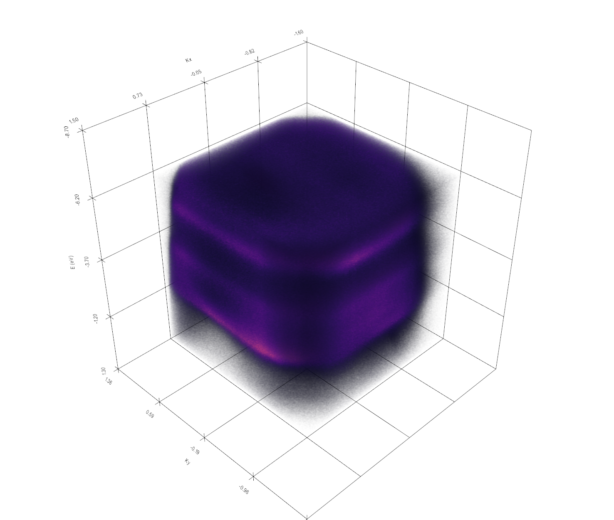
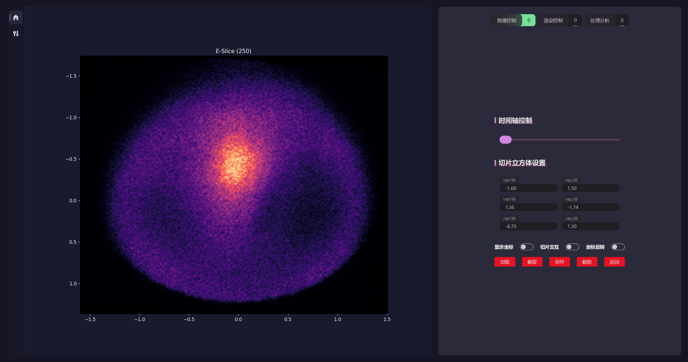
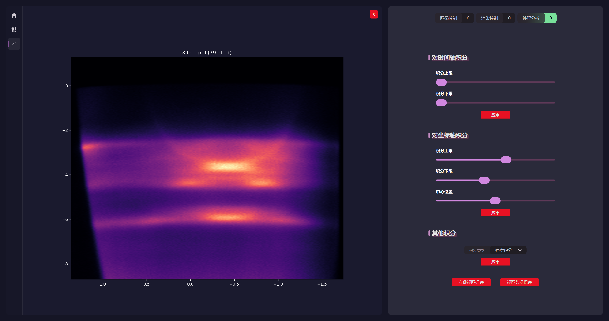
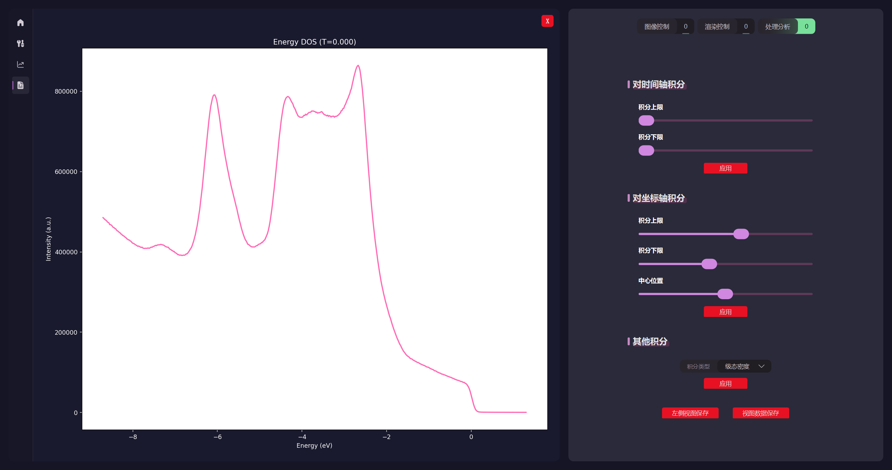

# ARPES-3d-MAP

三维数据可视化与分析工具，面向本地桌面实验环境，提供 `npz` / `mat` 数据加载、3D 体渲染、2D 切片、去噪、积分分析、DOS 分析、截图与结果导出等能力。

右侧控件栏界面由三部分组成：

- 图像控制：负责加载数据、时间轴滑动、切片范围、交互切片和基础截图导出
- 渲染控制：负责色图、黑白场/Gamma、强度映射和去噪设置
- 处理分析：负责时间积分、坐标轴积分、切片内强度积分、能级态密度曲线，以及结果页导出
## 参与贡献
    本项目所用GUI，基于github上ChinaIceF大佬的开源项目修改而来，参考大佬github的源码地址：https://github.com/ChinaIceF/PyQt-SiliconUI
## 核心功能

- `npz` 数据加载，支持将 `.mat` 文件自动转换为 `.npz` 后再分析
- 3D 体渲染与 2D 切片显示
- 按物理坐标输入切片范围，支持交互切片框
- 坐标显示开关与能量轴坐标反转
- 色图切换、黑白场/Gamma 调整、强度映射方式切换
- 多级去噪流程，包含高斯、滑动均值、Savitzky-Golay、小波、非局部均值等
- 对 4D 数据的时间积分与时序去噪支持
- 坐标轴积分、切片内态密度积分、能级态密度
- 左侧结果工作区与多结果页切换
- 截图导出与当前结果数据导出为 `mat` / `npz`

## 界面预览

> 以下示例基于作者本机静态谱样例 `NiHITP_calibrated_2.npz` 拍摄。由于该样例在 bin 数据时方向装反，截图前已开启“坐标反转”。该样例的 `sample` 形状为 `(500, 200, 200)`，属于静态 3D 数据，因此这里只展示其能覆盖的功能；时间积分和 Slice-DOS 在 README 中保留文字说明，不展示无效截图。

**3D 体渲染视图**



**E 切片视图**



**坐标轴积分结果页**



**Energy-DOS 结果页**



## 安装与运行

```powershell
python -m venv .venv
.\.venv\Scripts\activate
pip install -r requirements.txt
python start.py
```

说明：

- 依赖列表见 [requirements.txt](requirements.txt)
- 启动入口为 [start.py](start.py)
- `requirements.txt` 中包含 `PyQt-SiliconUI` 的 GitHub 依赖，首次安装需要联网

如果需要打包为桌面程序，可直接使用仓库中的 PyInstaller 配置：

```powershell
pyinstaller ARPES_3dMAP.spec
```

配置文件见 [ARPES_3dMAP.spec](ARPES_3dMAP.spec)。

## 支持的数据格式

### 推荐的 `npz` 字段

推荐输入字段如下：

```text
sample : 3D (Kx, Ky, E) 或 4D (Kx, Ky, E, T)
kx     : Kx 坐标，一维数组
ky     : Ky 坐标，一维数组
E      : 能量坐标，一维数组
time   : 时间 / delay 坐标，一维数组
```

说明：

- 程序会自动搜索 `npz` 中的主数据数组，优先识别 4D，再识别 3D
- 若坐标缺失，程序会按像素索引自动生成默认坐标
- 读入后内部会统一整理为 `(Kx, Ky, E, T)` 的分析格式
- 对于静态数据，程序会自动补一条长度为 1 的时间轴

### `.mat` 导入

导入 `.mat` 时，程序会先转换为 `.npz`。当前转换逻辑会优先识别以下常见字段别名：

- 主数据：`sample` / `binned` / `data`
- Kx 坐标：`kx` / `X`
- Ky 坐标：`ky` / `Y`
- 能量坐标：`E` / `energy`
- 时间坐标：`time` / `delay` / `t` / `T`

转换逻辑位于 [data_trans.py](data_trans.py)，如需要添加字段可自行更改。

## 推荐使用流程

### 1. 图像控制页

推荐先在“图像控制”页完成基础数据准备：

- 点击“加载”导入 `npz` 或 `mat`
- 使用时间轴滑块切换时间帧；对于静态数据，时间轴仅保留一个位置
- 通过 `X / Y / Z` 上下限输入框设置切片立方体范围
- 需要二维切片时，将任一轴的上下限设为同一个位置
- 勾选“显示坐标”显示物理坐标轴
- 勾选“切片交互”启用交互切片框
- 对当前样例请开启“坐标反转”，以修正能量轴方向
- 通过“截图”保存当前视图，通过“返回”恢复完整数据范围

### 2. 渲染控制页

在“渲染控制”页可以进一步调整显示效果：

- 切换色图
- 调整黑场 / 灰场 / 白场
- 切换强度映射方式
- 组合多个去噪步骤（当前仅Savitzky-Golay 和小波去噪参数可调）

### 3. 处理分析页

在“处理分析”页可以生成新的结果页：

- 对 4D 数据做时间积分
- 对 `X / Y / E` 任一轴做区间积分
- 计算切片内强度积分
- 计算当前时间帧的等能面内所有点的强度积分（能级态密度）
- 使用“左侧视图保存”保存当前结果图
- 使用“视图数据保存”导出当前结果页对应的数据

## 导出结果说明

不同结果页会导出不同结构的数据：

- 主页面切片立方体：导出当前切片范围内的 `sample`（sample代表多维数据体） 以及对应的 `kx` / `ky` / `E` / `time`
- 时间积分结果：导出积分后的 `sample` 以及 `kx` / `ky` / `E`
- 坐标轴积分结果：导出积分后的 `sample`，以及剩余坐标轴与 `time`
- 切片内强度积分：导出 `time` 与积分强度 `intensity`
- 能级态密度：导出当前时刻、`E` 与谱强度 `intensity`

导出时可保存为 `MATLAB Files (*.mat)` 或 `NumPy Files (*.npz)`。


## 已知限制与说明

- 静态 3D 数据无法真实展示时间积分与切片内强度积分的动态能力
- README 中提到的样例路径仅用于说明截图来源，不要求用户按该绝对路径组织数据
- 目前的去噪设置中仅“Savitzky-Golay滤波”和“小波去噪”参数可调，其他去噪方式的可调参数或许会在后续更新中加入

## 建议与反馈
- 若有其他改进建议或需添加功能或者bug反馈欢迎联系作者
- qq:1277514490
- 邮箱:jiaxinyu25@mails.ucas.ac.cn
- 打赏: