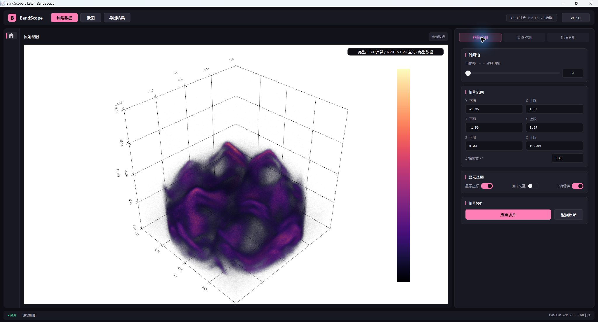

# BandScope

BandScope 是面向本地桌面实验环境的多维 ARPES 可视化与分析工作台，提供 `npz` / `mat` 数据加载、全局 ROI 数据域、3D 体渲染、2D 切片、交互裁剪、去噪、积分分析、DOS 分析、EDC 曲线、EDC 瀑布图、二阶导锐化、曲线比较、截图与结果导出等能力。当前源码版本为 **v1.5.0**。

> 本项目 GUI 基于 [ChinaIceF/PyQt-SiliconUI](https://github.com/ChinaIceF/PyQt-SiliconUI) 开源项目修改而来。

---

## 界面概览

### v1.5.0 更新

- 裁剪交互重构：顶部工具栏新增可保持选中态的 **裁剪** 按钮，3D 视图显示交互包围盒、2D / 1D / 瀑布图左键框选；右键「裁剪范围」浮层可直接输入各轴上下限，与框选双向同步。
- 每次裁剪生成新的结果页并保留来源页，可连续裁剪；截图与数据导出使用裁剪后的结果，瀑布图按显示坐标裁剪并保留曲线偏移，1D 曲线按数据点保留、缺口断开不插值。
- 删除「图像控制」页：时间轴与 **显示坐标 / E轴翻转 / Z轴旋转** 迁到画布下方的底条，视图控件右对齐常驻，滑条随窗口宽度伸缩、与控件只留一处与行内一致的间隙。
- 右侧控件面板由三个标签页精简为「渲染控制」「处理分析」两个，快捷键相应改为 `Ctrl + 1` / `Ctrl + 2`；各结果页仍分别保存自己的帧号、翻转与旋转状态。

### v1.4.0 更新

- 新增科研级图片导出：按左侧当前视图（3D / 2D / 1D）提供共九种样式，卡片预览与最终大图由同一快照、同一渲染器生成，导出前可微调画布背景、字体、边框、图例与色条排版。
- 图片导出支持 PNG；2D 与 1D 同时支持 PDF（热图为栅格，文字与曲线保留矢量）。导出在独立画布中完成，主视图的相机、色阶锁定、数据与页面状态在导出前后保持一致。
- 新增左侧时间轴条，显示当前帧与总帧数并支持拖动定位，随图像控制页的帧控件同步显隐。
- 处理分析：时间积分支持从坐标轴积分结果页（含裁剪页）派生同轴向、同积分区间的 2D 结果页。
- 布局与状态同步优化：统一卡片间距与滚动行为，修正程序化恢复状态时滑条与开关的视觉同步。

### v1.3.0 更新

- 统一深色界面、字体、数值输入框与按钮样式，按卡片组织控制项。
- 将加载数据、截图和结果导出集中到顶部工具栏，移除处理分析页的重复保存入口。
- 优化分栏宽度、页签与卡片间距，支持拖动分隔条及小窗口滚动操作。
- 切片范围采用两列输入布局，突出“应用切片”和“返回原始”；补充静态数据与时间锁定状态说明。
- 增加结果页标题、数据范围标记、底部状态栏和快捷键；普通操作反馈使用自动消失的轻提示。
- 修正程序化恢复状态时滑条、开关的视觉同步，并限制长色带菜单的展开高度。

应用窗口由工具栏、左右工作区和状态栏组成：

- **顶部 — 全局工具栏**：加载数据、截图样式、导出结果、裁剪、锁定色带、计算 / 渲染后端状态及版本更新入口。
- **左侧 — 结果工作区**：包含侧边栏导航（页面按钮）和主显示区域（3D 体渲染 / 2D 图像 / 1D 曲线 / 瀑布图 / 去噪参数面板）。每个分析结果以独立页面管理并保存自己的显示与分析控件状态；去噪参数跨页面共享，页面则保留创建时继承的数据范围。
- **左侧底部 — 画布底条**：左侧是时间轴（滑条 + 帧号 + 总帧数，仅含时间轴的数据展开），右侧右对齐排列 **显示坐标** / **E轴翻转** 开关与 **Z 轴旋转** 输入框；没有时间轴的数据只收起时间轴部分，视图控件常驻可用。
- **右侧 — 控件面板**：两个标签页，依次为「渲染控制」「处理分析」。
- **底部 — 状态栏**：运行状态、当前结果页、2D 光标坐标、数据形状与计算后端。

### 控件面板结构

| 标签页 | 主要功能 |
|---|---|
| 渲染控制 | 色带选择、黑场 / 灰场 / 白场色阶调整、强度映射方式（线性 / 对数 / 幂函数 / sigmoid）、三级去噪管线、计算后端选择 |
| 处理分析 | 时间积分、坐标轴积分（带物理坐标输入与中心锁定）、切片内强度积分、能级态密度、EDC 瀑布图、单条 EDC 曲线、二阶导 |

---

## 界面预览

**v1.4.0 主窗口**



本节图片均由本机 BandScope **v1.4.0** 实际运行界面截取（v1.5.0 起视图控件位于画布下方底条、右侧面板为两个标签页），使用 `WSe2_step.npz` 样例，数据形状为 `(150, 150, 200, 25)`（Kx、Ky、E、时间），包含 25 帧。样例的初始能量方向相反，加载后先开启 **E 轴翻转**，再生成切片与分析结果。以下截图均使用第 0 帧。

该文件未提供 E 坐标数组，因此截图中的能量数值使用默认索引 `0–199`；图中自动生成的 `eV` 标签不代表样例已完成能量标定。

设计稿及历史复查记录见 [design](design/)。

**3D 体渲染视图**


**E 切片视图**

开启顶部「裁剪」，在裁剪浮层中将 E 下限与上限均设为 `140`，点击「裁剪」得到等能面。


**坐标轴积分结果页**

沿 X 轴对索引 `74–86` 积分，对应界面显示的动量范围约为 `-0.11–0.18`。


**能级态密度结果页**

从完整数据的 3D 原始视图生成，展示第 0 帧（界面时间值 `-300.000`）的能级态密度。


---

## 安装与运行

### Windows 安装包（推荐）

正式发布后可从 [GitHub Releases](https://github.com/vergil-996/ARPES_3dMAP/releases) 下载与电脑环境对应的安装包：

- `BandScope-<版本>-Windows-x64-CPU-Setup.exe`：通用 CPU 版
- `BandScope-<版本>-Windows-x64-NVIDIA-Setup.exe`：包含 NVIDIA CUDA 数值后端的版本

安装器默认安装到当前用户的 `%LocalAppData%\Programs\BandScope`，不要求管理员权限。CPU 与 NVIDIA 安装包使用相同的应用标识，可以直接互相覆盖升级，用户设置仍保存在独立的 `QSettings` 中。

以前使用压缩包的用户需要手动运行一次 BandScope 安装器；自动更新能力从这次安装完成后开始生效。

安装版启动约 5 秒后会在后台检查 GitHub 最新正式 Release，每 12 小时最多自动检查一次；也可以点击顶部工具栏右侧的版本按钮手动检查。自动检查失败时会弹窗提示原因，并建议在开启 VPN 或网络代理后手动检查，弹窗中的「三天内不再提示」只会静音后续失败提示，后台检查仍照常进行。发现新版后，BandScope 会：

1. 选择与当前 CPU / NVIDIA 构建一致的安装包
2. 下载到当前用户的更新缓存目录
3. 使用 GitHub Release API 返回的 SHA-256 摘要校验完整性
4. 经用户确认后启动安装器并退出，由安装器在原目录完成覆盖升级

新版本提示框中的「一周内不再提示」会让此后一周的自动检查不再弹窗（检查本身继续执行），手动点击版本按钮仍然正常提示；「跳过此版本」则只针对当前这一个版本生效。

从源码运行时只会提示新版并打开 Release 页面，不会尝试覆盖源码目录。尚未配置代码签名证书时，更新确认框会明确警告；正式对外分发前建议签名安装包，并在 `app_metadata.py` 中填写发布证书的 SHA-256 指纹。

### 从源码运行

Windows PowerShell:

```powershell
py -3.12 -m venv .venv
.\.venv\Scripts\activate
pip install -r requirements.txt
python start.py
```

如果 PowerShell 提示 `Activate.ps1` 被禁用，可以直接使用虚拟环境里的 Python 运行：

```powershell
.\.venv\Scripts\python.exe -m pip install -r requirements.txt
.\.venv\Scripts\python.exe start.py
```

macOS / Linux:

```bash
python3.12 -m venv .venv
source .venv/bin/activate
python -m pip install -r requirements.txt
python start.py
```

说明：

- 依赖列表见 [requirements.txt](requirements.txt)
- 启动入口为 [start.py](start.py)
- `requirements.txt` 中包含 `PyQt-SiliconUI` 的 GitHub 依赖，首次安装需要联网

---

## 支持的数据格式

### 推荐的 `npz` 字段

推荐输入字段如下：

```text
sample : 3D (Kx, Ky, E) 或 4D (Kx, Ky, E, T)
kx     : Kx 坐标，一维数组
ky     : Ky 坐标，一维数组
E      : 能量坐标，一维数组
time   : 时间 / delay 坐标，一维数组
```

说明：

- 程序会自动搜索 `npz` 中的主数据数组，优先识别 4D，再识别 3D
- 若坐标缺失，程序会按像素索引自动生成默认坐标
- 读入后内部会统一整理为 `(Kx, Ky, E, T)` 的分析格式
- 对于静态数据，程序会自动补一条长度为 1 的时间轴

### `.mat` 导入

导入 `.mat` 时，程序会先转换为 `.npz`。当前转换逻辑会优先识别以下常见字段别名：

- 主数据：`sample` / `binned` / `data`
- Kx 坐标：`kx` / `X`
- Ky 坐标：`ky` / `Y`
- 能量坐标：`E` / `energy`
- 时间坐标：`time` / `delay` / `t` / `T`

转换逻辑位于 [data_trans.py](data_trans.py)，如需要添加字段可自行更改。

---

## 快捷键

| 快捷键 | 作用 |
|---|---|
| `Ctrl + O` | 加载数据 |
| `Ctrl + S` | 将当前视图保存为 PNG |
| `Ctrl + 1` / `Ctrl + 2` | 切换到渲染控制 / 处理分析 |
| `Ctrl + W` | 关闭当前可关闭的结果页 |
| `←` / `→` | 时间轴后退 / 前进一帧 |
| `Shift + ←` / `Shift + →` | 时间轴后退 / 前进十帧 |
| `Shift` | 光标所在区域（左侧视图 / 右侧控件）切换到下一页 |
| `Ctrl` | 光标所在区域切换到上一页 |
| `1` / `2` / `3` / `4` | 数字键切换到对应位置的结果页或控件页 |
| `Ctrl + C` | 当左侧显示 1D 曲线结果页时，复制当前曲线到剪贴板 |
| `Ctrl + V` | 将剪贴板中的曲线粘贴到当前 1D 曲线页，生成曲线比较图 |
| 鼠标滚轮 | 所有下拉框内的值可由鼠标滚轮快捷更改 |
| `Esc` | 裁剪模式下关闭「裁剪范围」浮层；浮层已关闭时退出裁剪模式 |
| 右键菜单 | 在 3D 视图或 2D 图上右键可弹出“去噪参数设置”“瀑布图步长设置”等快捷入口；裁剪模式下右键改为弹出「裁剪范围」浮层 |

输入框、下拉框或其他滑条持有焦点时，方向键优先用于当前控件，不触发时间轴切帧。

---

## 控件功能说明

### 1. 画布底条

先从顶部工具栏加载数据，再在画布下方的底条上调整视图（原「图像控制」页已删除，控件全部收进底条）：

- 点击顶部 **加载数据** 导入 `npz` 或 `mat`
- 使用底条左侧时间轴的滑块或帧号输入框切换时间帧；静态数据禁用切帧并收起时间轴部分，只显示“静态数据 · 无时间维度”
- **Z 轴旋转角度**：在 Kx-Ky 平面内旋转 3D 数据体（-360° ~ 360°），位于底条最右
- 勾选 **显示坐标** 显示物理坐标轴
- **E轴翻转** 开关用于反转 E 轴显示方向：3D 视图保持 X/Y 数据轴不动并自动应用等价于上下拖动 180° 的相机视角；含能量轴的 2D/1D 结果同步反转
- 底条三个视图控件（显示坐标 / E轴翻转 / Z 轴旋转）右对齐常驻；滑条随窗口宽度伸缩、一直铺到视图控件前，与控件之间只留一处与行内一致的间隙，不会重叠
- 切换到其他结果页用左侧导航栏的页面按钮（`Ctrl+W` 关闭当前页，数字键跳页）；当前视图的截图与数据导出统一使用顶部工具栏

#### 裁剪模式

点击顶部工具栏的 **裁剪** 进入裁剪模式（按钮保持选中态，再次点击或在画布上按 `Esc` 退出）：

- 3D 体渲染中显示交互包围盒，拖拽手柄调整范围；2D / 1D / 瀑布图上直接用鼠标左键框选
- 右键弹出「裁剪范围」浮层，可直接输入各轴上下限数值；框选与数值双向同步，浮层始终限制在屏幕内
- 点击浮层中的 **裁剪** 生成新的裁剪结果页，来源页保持不变；每个页面的框选草稿独立保留
- 按 `Esc` 或点击浮层外可关闭浮层，草稿不会丢失
- 3D 中将任一轴的上下限设为同一位置时，裁剪生成该单层的 2D 结果页
- 3D 中三个轴都有厚度且旋转角为 `0°` 时，裁剪会提交一个覆盖全部 delay 帧的全局 ROI 数据域
- 坐标轴积分结果页上框选矩形并裁剪，生成裁剪后的结果页（`axis_integral_crop`），可用于限制 EDC 瀑布图的 k 值取值范围，或生成单条 EDC 曲线

#### 全局 ROI 数据域

全局 ROI 用于将后续分析限制在感兴趣的三维空间范围内，适合费米面以下强带掩盖弱激发态等场景。

- 原始四维数据始终只读保留；每次新 ROI 都按照交互盒在原始 X/Y/E 索引中的绝对边界重新提取，不会相对上一个 ROI 继续裁剪
- ROI 只限制 X、Y、E，delay 轴保持完整
- 内部仅保存紧凑 ROI，不创建同尺寸的四维零背景副本
- 3D 使用带原始绝对索引 `extent` 的紧凑网格；2D/1D 在显示阶段嵌回完整坐标域，因此 ROI 外视觉强度为 0
- 时间积分、坐标轴积分、DOS、EDC、瀑布图和二阶导等后续计算只读取页面所属 ROI 与请求范围的交集
- 去噪和二阶导在紧凑 ROI 的局部边界内执行，避免把 ROI 外的虚拟零当成真实数据并在边缘制造伪峰
- 已存在的结果页固定使用创建时的数据范围；新页面继承直接来源页的数据范围。更换主页 ROI 不会修改旧页面
- 单层平面截取只生成临时 2D 视图，不会提交全局 ROI
- 非零旋转角下不能提交 ROI；ROI 页面需要旋转时，仅临时构造当前三维帧的零背景体，不创建全尺寸四维副本

### 2. 渲染控制页

在「渲染控制」页可以进一步调整显示效果：

- 切换色带（33 种 colormap，含 magma / inferno / viridis / coolwarm / jet 等）
- 调整 **黑场** / **灰场** / **白场**（0-100 滑块，灰场对应 Gamma 校正，50 为线性映射）
- 切换强度映射方式：**线性** / **对数** / **幂函数** / **sigmoid**
- 三级去噪管线（自上向下依次生效）：
  - **频域平滑** — 高斯滤波
  - **滑动平均** — 中值滤波
  - **Savitzky-Golay 滤波** — 多项式平滑（可调窗口长度、阶数、滑动轴）
  - **小波去噪** — 多级小波阈值去噪（可调小波基、分解层数、阈值规则、阈值模式、强度）
  - **卡尔曼滤波** — 沿时间轴的递归状态估计（仅 4D 数据有效）
  - **贝叶斯去噪** — 非局部均值去噪（NL-means）
- 去噪参数跨页面共享。应用后当前页面立即刷新，其他页面在再次激活时按照各自的数据范围延迟计算；曲线比较页保持创建时的快照
- 应用新的 S-G 参数前会统一验证所有仍被页面引用的数据域；窗口长度超过任一 ROI 对应轴长度时，整次应用会被拒绝并保留上一套结果

### 3. 处理分析页

在「处理分析」页可以生成新的结果页。每个生成的结果页独立管理，可关闭、可切换。生成结果后，使用顶部“截图”保存图像，或使用“导出结果”保存数据。

#### 3.1 时间积分

对 4D 数据的指定时间范围求和积分，并根据原始视图的当前形态生成结果页。

- 拖动积分上/下限滑块设置范围，点击 **应用**
- 原始视图为 3D 时，生成 3D 体渲染结果页
- 原始视图为 X / Y / E 单层 2D 切片时，生成同轴向的 2D 时间积分结果页；初始位置保持当前切片
- 原始视图为坐标轴积分结果页（含裁剪页）时，生成同轴向、同积分区间的 2D 时间积分结果页
- 2D 时间积分结果可由坐标轴积分区域的中心、上限和下限滑块实时控制切片位置与积分厚度
- 适用于含时间轴的动态数据

#### 3.2 坐标轴积分

对 X / Y / E 任一轴做区间积分，生成 2D 结果页。

- 下拉框选择轴向（X / Y / Z）
- 滑块设置积分下限、上限和中心位置
- 物理坐标输入框（`QDoubleSpinBox`）支持直接输入物理坐标值，与滑块双向联动
- 中心位置锁定机制：拖动上/下限时自动维持中心对称
- 点击 **应用** 生成结果页

坐标轴积分结果页上的交互：

- 开启顶部「裁剪」模式后，可用鼠标左键在 2D 图上框选矩形区域，右键打开「裁剪范围」浮层微调数值，点击「裁剪」生成裁剪后的结果页（`axis_integral_crop`）
- 每个页面的框选草稿独立保留，按 `Esc` 或点击浮层外可关闭浮层
- 裁剪结果页可用于限制 EDC 瀑布图的 k 值取值范围，或生成单条 EDC 曲线

#### 3.3 其他积分

在下拉框中选择分析类型后点击 **应用**：

| 类型 | 说明 |
|---|---|
| **切片内强度积分** | 将当前切片立方体内所有点的强度积分，横轴为时间，纵轴为总强度（仅 4D 数据有效） |
| **能级态密度** | 将等能面内所有点按强度积分，横轴为能量，纵轴为总强度。可从 3D 原始数据或坐标轴积分结果页生成 |
| **EDC 瀑布图** | 从 X/Y 轴积分结果页按步长选取一组动量值，画出错位堆叠的能量分布曲线 |
| **单条 EDC 曲线** | 从 Z 轴积分的裁剪结果页生成单条能量分布曲线 |
| **二阶导** | 2D 图沿能量轴计算强度负二阶导；3D 体视图可选择 X、Y 或 E 方向计算并生成新的 3D 体数据，用于锐化能带 |

---

## 结果工作区（左侧）

每个分析操作会生成一个新的结果页，显示在左侧导航栏中：

- **原始视图**（Home，不可关闭）— 初始数据显示页
- **时间积分** — 原始视图为 3D 时显示 3D 体渲染；原始视图为单层切片时显示可交互的 2D 结果
- **坐标轴积分 / 裁剪** — 2D 图像结果
- **切片内强度积分** — 1D 曲线（时间 vs 强度）
- **能级态密度** — 1D 曲线（能量 vs 强度）
- **EDC 瀑布图** — 堆叠曲线
- **单条 EDC 曲线** — 1D 曲线（能量 vs 强度）
- **二阶导** — 2D 图像或 3D 体渲染结果
- **曲线比较** — 1D 多曲线叠加对比

每个结果页独立管理：

- 切换页面时自动保存 / 恢复该页面的显示和分析控件状态
- 每个页面持久保存自己的数据域编号；新派生页继承直接来源页的数据域
- 去噪参数全局共享，但去噪结果按页面数据域缓存并在需要时计算
- 曲线比较页是快照，不随之后的去噪或数据域调整重新计算
- 可关闭的页面点击 X 按钮删除
- 加载新数据时自动清除所有结果页，重置为原始视图

---

## 曲线比较功能

支持将同类型的 1D 曲线（能级态密度、切片内强度积分、单条 EDC 曲线）进行叠加比较：

1. 在 1D 曲线结果页下按 `Ctrl + C` 复制当前曲线
2. 切换到另一个同类型 1D 曲线结果页，按 `Ctrl + V` 粘贴
3. 自动生成「比较」结果页，基准曲线与叠加曲线以不同颜色和线型区分，并显示图例

也可在 2D 曲线图上右键选择「复制」/「粘贴」。

---

## 去噪参数设置

在 3D 视图或 2D 图上右键，选择 **去噪参数设置** 打开快捷窗口。三级去噪方法及其应用按钮位于右侧「渲染控制」页。

可调参数：

| 方法 | 参数 |
|---|---|
| Savitzky-Golay 滤波 | 滑动窗口长度（奇数，≥3）、多项式阶数（0-4）、窗口滑动轴（E / Kx / Ky） |
| 小波去噪 | 小波基（haar / db2 / db4 / sym4 / coif1）、分解层数（1-6）、阈值规则（universal / SURE / Bayes）、阈值模式（soft / hard）、强度（0-10） |

执行顺序固定为“提取页面数据域 → 在紧凑数据域内执行 S-G / 小波去噪 → 原子提交结果”。异步任务失败或被新任务取代时，界面继续显示上一套完整结果，不会出现半处理状态。

---

## 导出结果说明

### 截图

点击顶部工具栏的 **截图**，或按 `Ctrl + S`，将当前显示的图像或曲线保存为 PNG。

### 数据导出

点击顶部工具栏的 **导出结果**，可选择导出为 `.mat` 或 `.npz`；支持表格化的结果还提供 `.txt` / `.csv` 格式。数据尚未就绪或当前页不支持数据导出时，按钮禁用。曲线比较页可截图，暂不导出叠加曲线数据。

不同结果页导出不同结构的数据：

| 结果页类型 | 导出字段 |
|---|---|
| 完整数据主页 | `sample`、`kx`、`ky`、`E`、`time` |
| ROI 主页 | 紧凑 `sample`、ROI 对应的 `kx`、`ky`、`E`、完整 `time` |
| 时间积分 | `sample`、`kx`、`ky`、`E` |
| 坐标轴积分（X） | `sample`、`ky`、`E`、`time` |
| 坐标轴积分（Y） | `sample`、`kx`、`E`、`time` |
| 坐标轴积分（Z） | `sample`、`kx`、`ky`、`time` |
| 时间积分来源的 2D 坐标轴积分 | `sample`、剩余两条坐标轴、`integrated_axis`、`integrated_range`、`integrated_center`、`source_t_indices`、`source_t_range` |
| 坐标轴积分裁剪 | `sample`、`k`/坐标标签、`E`/坐标标签、`integrated_axis`、`integrated_range`、`crop_range` |
| 切片内强度积分 | `time`、`intensity` |
| 能级态密度 | `E`、`intensity`（含 `time` 或 `time_range` 元数据） |
| EDC 瀑布图 | `k`、`E`、`intensity`、`integrated_axis`、`integrated_range` |
| 单条 EDC 曲线 | `E`、`intensity`、`kx_range`、`ky_range`、`source_mode` |
| 二阶导（2D） | `sample`、`E`（含对应动量坐标标签） |
| 二阶导（3D） | `sample`、`kx`、`ky`、`E`、`derivative_axis`、`source_mode`，以及单帧的 `source_t_index`/`time` 或时间积分的 `source_t_indices`/`source_t_range` |

ROI 来源页面还会写入 `data_scope_id`、`data_scope_label`、`roi_index_bounds` 和 `roi_physical_bounds` 元数据。页面专属的 2D 矩形裁剪会继续在该页面的数据域基础上裁剪。

---

## 性能与缓存

- 原始四维数组作为只读数据源保留，不因 ROI 切换而复制或覆盖
- ROI、去噪结果和派生计算均使用包含数据域签名的缓存键
- 处理结果缓存采用按字节计量的 LRU，上限为一个原始四维数组的大小
- 3D 零旋转 ROI 使用紧凑计算与紧凑 VTK 网格；只有非零旋转需要临时构造一个全尺寸三维体
- 计算任务异步执行，并采用“最新请求优先”的原子提交方式，避免旧任务覆盖新的页面状态
- 2D 坐标气泡和矩形拖选使用局部 blit，鼠标移动时不会重复重绘整张 Matplotlib 图
- NVIDIA CUDA 可用时可选择 GPU 后端；不可用或运行失败时会自动回退到 CPU

---

## 各分析功能的详细说明

### 1. 切片内强度积分

将用户设置的切片立方体内所有点按强度积分，横轴为时间，纵轴为总强度。

- 需要先有 ROI 范围：在 3D 视图用顶部「裁剪」按钮框定范围并裁剪，否则会提示「未进行切片设置」
- 不可用于没有时间轴的静态谱
- 可被画布底条上的「E轴翻转」开关调控
- 可被「渲染控制」里的去噪设置调控

### 2. 能级态密度

将等能面内所有点按强度积分，横轴为能量，纵轴为总强度。

- 可从 3D 原始视图生成（支持切片立方体限制范围），也可以从 X/Y 轴积分结果页生成
- 从坐标轴积分结果页生成时，自动使用该积分页的积分范围和裁剪区域
- 可被画布底条上的时间轴滑条调控
- 可被画布底条上的「E轴翻转」开关调控
- 可被「渲染控制」里的去噪设置调控

### 3. EDC 瀑布图

将坐标轴积分（仅限 Kx 或 Ky 轴积分）后的 2D 图像内按照步长选取一组动量值，画出这些动量值上的能量分布曲线（横轴为强度，纵轴为能量），曲线自动错位堆叠，并在底部标注对应动量值。

- 点击应用时，左侧视图页面必须为 X 轴 / Y 轴积分结果页，否则会弹出报错框
- k 步长可在左侧去噪参数面板或右键弹出窗口中设置；程序会根据坐标间距自动推荐默认步长
- 用户自定义步长后进入"自定义"模式，切换页面不会丢失
- 若源页面有矩形裁剪，瀑布图自动使用裁剪后的 k 范围
- 坐标轴积分的上下限会影响最终曲线形状
- 可被画布底条上的时间轴滑条调控
- 可被「渲染控制」里的去噪设置调控

___开启顶部“裁剪”模式后，可用鼠标左键在 2D 视图内框选矩形区域，右键打开浮层微调数值并点击“裁剪”生成裁剪结果页，用于限制 EDC 瀑布图 k 值的取值范围。___

### 4. 二阶导

用于生成强度的负二阶导锐化结果：

- 左侧为 X/Y 切片或 X/Y 轴积分结果时，固定沿能量轴计算，生成 2D 图像
- 左侧为主页或时间积分的 3D 体视图时，应用后弹窗选择 X、Y 或 E 求导方向；程序沿所选方向处理整个体数据并生成新的 3D 结果页
- 3D 计算在数值上等价于对包含所选方向的所有 2D 切片逐一求导后重新堆叠
- X/Y 切片生成的 2D 二阶导页由空间轴“中心位置”滑条切换切片，积分上下限控件会自动禁用
- X/Y 轴积分生成的 2D 二阶导页由积分下限、积分上限和中心位置三个滑条动态控制
- 2D 二阶导的滑条变化使用 35 ms 合并刷新，松开滑条时立即完成最终刷新

- 可被画布底条上的时间轴滑条调控
- 可被画布底条上的「E轴翻转」开关调控
- 可被「渲染控制」里的色带选择调控
- 可被「渲染控制」里的去噪设置调控

### 5. 单条 EDC 曲线

在坐标轴积分结果页（Z 轴）上框选矩形区域并截取后，生成单条能量分布曲线。

- 点击应用时，左侧视图页面必须为 Z 轴积分的裁剪结果页（`axis_integral_crop`），否则会弹出报错框
- 可被画布底条上的时间轴滑条调控
- 可被画布底条上的「E轴翻转」开关调控
- 可被「渲染控制」里的去噪设置调控

---

## 已知限制与说明

- 静态 3D 数据无法真实展示时间积分与切片内强度积分的动态能力
- README 中提到的样例路径仅用于说明截图来源，不要求用户按该绝对路径组织数据
- 目前的去噪设置中仅 Savitzky-Golay 滤波和小波去噪参数可调；频域平滑、滑动平均、卡尔曼滤波和贝叶斯去噪使用内置默认参数，可调参数可能会在后续更新中加入
- 曲线比较功能仅支持同类型的 1D 曲线（横轴必须匹配），不支持跨类型比较
- 泵浦前绝对差分 `ΔI` 与零中心发散色带尚未加入当前版本

---

## 参与贡献

本项目所用 GUI，基于 GitHub 上 ChinaIceF 大佬的开源项目修改而来，参考大佬 GitHub 的源码地址：https://github.com/ChinaIceF/PyQt-SiliconUI

---

## 建议与反馈

- 若有其他改进建议或需添加功能或者 bug 反馈欢迎联系作者
- QQ：1277514490
- 邮箱：jiaxinyu25@mails.ucas.ac.cn
- 打赏：
