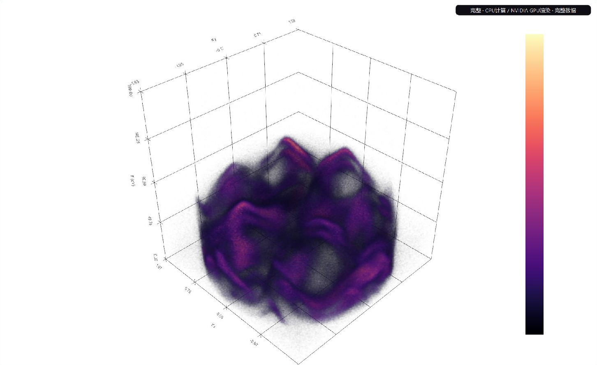
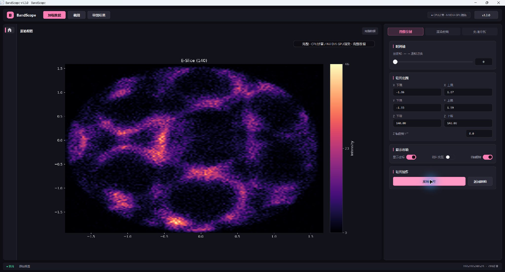
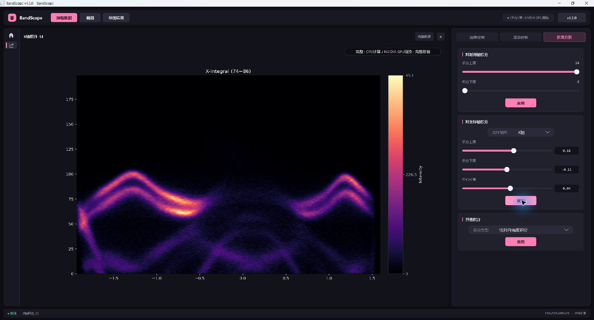
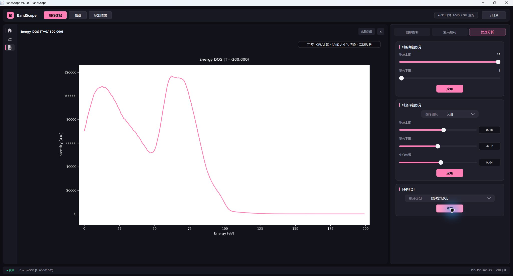

# ARPES-3d-MAP

三维数据可视化与分析工具，面向本地桌面实验环境，提供 `npz` / `mat` 数据加载、3D 体渲染、2D 切片、去噪、积分分析、DOS 分析、EDC 曲线、EDC 瀑布图、二阶导锐化、曲线比较、截图与结果导出等能力。

> 本项目 GUI 基于 [ChinaIceF/PyQt-SiliconUI](https://github.com/ChinaIceF/PyQt-SiliconUI) 开源项目修改而来。

---

## 界面概览

应用窗口采用左右分栏布局：

- **左侧 — 结果工作区**：包含侧边栏导航（页面按钮）和主显示区域（3D 体渲染 / 2D 图像 / 1D 曲线 / 瀑布图 / 去噪参数面板）。每个分析结果以独立页面管理，可在不同结果页之间切换，每个页面独立保存其控件状态与去噪设置。
- **右侧 — 控件面板**：三个标签页，依次为「图像控制」「渲染控制」「处理分析」。

### 控件面板结构

| 标签页 | 主要功能 |
|---|---|
| 图像控制 | 加载数据、时间轴滑动、切片立方体范围设置、Z 轴旋转、切片交互框、坐标显示 / 图像翻转开关、截图与返回 |
| 渲染控制 | 色带选择、黑场 / 灰场 / 白场色阶调整、强度映射方式（线性 / 对数 / 幂函数 / sigmoid）、三级去噪管线 |
| 处理分析 | 时间积分、坐标轴积分（带物理坐标输入与中心锁定）、切片内强度积分、能级态密度、EDC 瀑布图、单条 EDC 曲线、二阶导、左侧视图保存 / 视图数据导出 |

---

## 界面预览

> 以下示例基于作者本机静态谱样例 `NiHITP_calibrated_2.npz` 拍摄。由于该样例在 bin 数据时方向装反，截图前已开启"图像翻转"。该样例的 `sample` 形状为 `(500, 200, 200)`，属于静态 3D 数据，因此这里只展示其能覆盖的功能；时间积分和切片内强度积分在 README 中保留文字说明，不展示无效截图。

**3D 体渲染视图**



**E 切片视图**



**坐标轴积分结果页**



**能级态密度结果页**



---

## 安装与运行

Windows PowerShell:

```powershell
py -3.12 -m venv .venv
.\.venv\Scripts\activate
pip install -r requirements.txt
python start.py
```

如果 PowerShell 提示 `Activate.ps1` 被禁用，可以直接使用虚拟环境里的 Python 运行：

```powershell
.\.venv\Scripts\python.exe -m pip install -r requirements.txt
.\.venv\Scripts\python.exe start.py
```

macOS / Linux:

```bash
python3.12 -m venv .venv
source .venv/bin/activate
python -m pip install -r requirements.txt
python start.py
```

说明：

- 依赖列表见 [requirements.txt](requirements.txt)
- 启动入口为 [start.py](start.py)
- `requirements.txt` 中包含 `PyQt-SiliconUI` 的 GitHub 依赖，首次安装需要联网

如果需要打包为桌面程序，可直接使用仓库中的 PyInstaller 配置：

```powershell
pyinstaller ARPES_3dMAP.spec
```

配置文件见 [ARPES_3dMAP.spec](ARPES_3dMAP.spec)。

---

## 支持的数据格式

### 推荐的 `npz` 字段

推荐输入字段如下：

```text
sample : 3D (Kx, Ky, E) 或 4D (Kx, Ky, E, T)
kx     : Kx 坐标，一维数组
ky     : Ky 坐标，一维数组
E      : 能量坐标，一维数组
time   : 时间 / delay 坐标，一维数组
```

说明：

- 程序会自动搜索 `npz` 中的主数据数组，优先识别 4D，再识别 3D
- 若坐标缺失，程序会按像素索引自动生成默认坐标
- 读入后内部会统一整理为 `(Kx, Ky, E, T)` 的分析格式
- 对于静态数据，程序会自动补一条长度为 1 的时间轴

### `.mat` 导入

导入 `.mat` 时，程序会先转换为 `.npz`。当前转换逻辑会优先识别以下常见字段别名：

- 主数据：`sample` / `binned` / `data`
- Kx 坐标：`kx` / `X`
- Ky 坐标：`ky` / `Y`
- 能量坐标：`E` / `energy`
- 时间坐标：`time` / `delay` / `t` / `T`

转换逻辑位于 [data_trans.py](data_trans.py)，如需要添加字段可自行更改。

---

## 快捷键

| 快捷键 | 作用 |
|---|---|
| `Shift` | 光标所在区域（左侧视图 / 右侧控件）切换到下一页 |
| `Ctrl` | 光标所在区域切换到上一页 |
| `1` / `2` / `3` / `4` | 数字键切换到对应位置的结果页或控件页 |
| `Ctrl + C` | 当左侧显示 1D 曲线结果页时，复制当前曲线到剪贴板 |
| `Ctrl + V` | 将剪贴板中的曲线粘贴到当前 1D 曲线页，生成曲线比较图 |
| 鼠标滚轮 | 所有下拉框内的值可由鼠标滚轮快捷更改 |
| 右键菜单 | 在 3D 视图或 2D 图上右键可弹出"去噪参数设置"与"瀑布图步长设置"快捷入口 |

---

## 控件功能说明

### 1. 图像控制页

推荐先在「图像控制」页完成基础数据准备：

- 点击 **加载** 导入 `npz` 或 `mat`
- 使用时间轴滑块切换时间帧；对于静态数据，时间轴仅保留一个位置
- 通过 `X / Y / Z` 上下限输入框设置切片立方体范围
- 需要二维切片时，将任一轴的上下限设为同一个位置，点击 **截取**
- **Z 轴旋转角度**：在 Kx-Ky 平面内旋转 3D 数据体（-360° ~ 360°）
- 勾选 **显示坐标** 显示物理坐标轴
- 勾选 **切片交互** 启用交互切片框（3D 体渲染中显示粉色包围盒，拖拽同步更新切片范围）
- **图像翻转** 开关用于翻转左侧视图（对 3D 图像、2D 切片及 1D 曲线均有效）
- 通过 **截图** 保存当前视图为 PNG，通过 **返回** 恢复完整数据范围并回到原始视图

### 2. 渲染控制页

在「渲染控制」页可以进一步调整显示效果：

- 切换色带（33 种 colormap，含 magma / inferno / viridis / coolwarm / jet 等）
- 调整 **黑场** / **灰场** / **白场**（0-100 滑块，灰场对应 Gamma 校正，50 为线性映射）
- 切换强度映射方式：**线性** / **对数** / **幂函数** / **sigmoid**
- 三级去噪管线（自上向下依次生效）：
  - **频域平滑** — 高斯滤波
  - **滑动平均** — 中值滤波
  - **Savitzky-Golay 滤波** — 多项式平滑（可调窗口长度、阶数、滑动轴）
  - **小波去噪** — 多级小波阈值去噪（可调小波基、分解层数、阈值规则、阈值模式、强度）
  - **卡尔曼滤波** — 沿时间轴的递归状态估计（仅 4D 数据有效）
  - **贝叶斯去噪** — 非局部均值去噪（NL-means）
- 每个结果页独立保存其去噪设置，切换页面自动恢复对应的去噪状态

### 3. 处理分析页

在「处理分析」页可以生成新的结果页。每个生成的结果页独立管理，可关闭、可切换。

#### 3.1 时间积分

对 4D 数据的指定时间范围求和积分，生成 3D 体渲染结果页。

- 拖动积分上/下限滑块设置范围，点击 **应用**
- 适用于含时间轴的动态数据

#### 3.2 坐标轴积分

对 X / Y / E 任一轴做区间积分，生成 2D 结果页。

- 下拉框选择轴向（X / Y / Z）
- 滑块设置积分下限、上限和中心位置
- 物理坐标输入框（`QDoubleSpinBox`）支持直接输入物理坐标值，与滑块双向联动
- 中心位置锁定机制：拖动上/下限时自动维持中心对称
- 点击 **应用** 生成结果页

坐标轴积分结果页上的交互：

- 开启「切片交互」后，可用鼠标左键在 2D 图上框选矩形区域，点击「截取」生成裁剪后的结果页（`axis_integral_crop`）
- 右键点击可清除当前裁剪选区
- 裁剪结果页可用于限制 EDC 瀑布图的 k 值取值范围，或生成单条 EDC 曲线

#### 3.3 其他积分

在下拉框中选择分析类型后点击 **应用**：

| 类型 | 说明 |
|---|---|
| **切片内强度积分** | 将当前切片立方体内所有点的强度积分，横轴为时间，纵轴为总强度（仅 4D 数据有效） |
| **能级态密度** | 将等能面内所有点按强度积分，横轴为能量，纵轴为总强度。可从 3D 原始数据或坐标轴积分结果页生成 |
| **EDC 瀑布图** | 从 X/Y 轴积分结果页按步长选取一组动量值，画出错位堆叠的能量分布曲线 |
| **单条 EDC 曲线** | 从 Z 轴积分的裁剪结果页生成单条能量分布曲线 |
| **二阶导** | 对 2D 图（E 切片或 X/Y 轴积分）沿能量轴做拉普拉斯曲率计算，用于锐化能带 |

---

## 结果工作区（左侧）

每个分析操作会生成一个新的结果页，显示在左侧导航栏中：

- **原始视图**（Home，不可关闭）— 初始数据显示页
- **时间积分** — 3D 体渲染结果
- **坐标轴积分 / 裁剪** — 2D 图像结果
- **切片内强度积分** — 1D 曲线（时间 vs 强度）
- **能级态密度** — 1D 曲线（能量 vs 强度）
- **EDC 瀑布图** — 堆叠曲线
- **单条 EDC 曲线** — 1D 曲线（能量 vs 强度）
- **二阶导** — 2D 图像结果
- **曲线比较** — 1D 多曲线叠加对比

每个结果页独立管理：
- 切换页面时自动保存 / 恢复控件状态（包括色带、色阶、去噪设置等）
- 去噪设置按页面独立缓存，修改后仅影响当前页
- 可关闭的页面点击 X 按钮删除
- 加载新数据时自动清除所有结果页，重置为原始视图

---

## 曲线比较功能

支持将同类型的 1D 曲线（能级态密度、切片内强度积分、单条 EDC 曲线）进行叠加比较：

1. 在 1D 曲线结果页下按 `Ctrl + C` 复制当前曲线
2. 切换到另一个同类型 1D 曲线结果页，按 `Ctrl + V` 粘贴
3. 自动生成「比较」结果页，基准曲线与叠加曲线以不同颜色和线型区分，并显示图例

也可在 2D 曲线图上右键选择「复制」/「粘贴」。

---

## 去噪参数设置

两种方式进入去噪参数面板：

1. 通过右侧控件栏顶部的导航切换到去噪参数面板（第三页的空白页区域）
2. 在 3D 视图或 2D 图上右键，选择 **去噪参数设置** 弹出快捷窗口

可调参数：

| 方法 | 参数 |
|---|---|
| Savitzky-Golay 滤波 | 滑动窗口长度（奇数，≥3）、多项式阶数（0-4）、窗口滑动轴（E / Kx / Ky） |
| 小波去噪 | 小波基（haar / db2 / db4 / sym4 / coif1）、分解层数（1-6）、阈值规则（universal / SURE / Bayes）、阈值模式（soft / hard）、强度（0-10） |

---

## 导出结果说明

### 截图

点击「截图」按钮或在处理分析页点击「左侧视图保存」将当前视图保存为 PNG。

### 数据导出

点击「保存」按钮或在处理分析页点击「视图数据导出」，可选择导出为 `.mat` 或 `.npz`。不同结果页导出不同结构的数据：

| 结果页类型 | 导出字段 |
|---|---|
| 主页面切片立方体 | `sample`、`kx`、`ky`、`E`、`time` |
| 时间积分 | `sample`、`kx`、`ky`、`E` |
| 坐标轴积分（X） | `sample`、`ky`、`E`、`time` |
| 坐标轴积分（Y） | `sample`、`kx`、`E`、`time` |
| 坐标轴积分（Z） | `sample`、`kx`、`ky`、`time` |
| 坐标轴积分裁剪 | `sample`、`k`/坐标标签、`E`/坐标标签、`integrated_axis`、`integrated_range`、`crop_range` |
| 切片内强度积分 | `time`、`intensity` |
| 能级态密度 | `E`、`intensity`（含 `time` 或 `time_range` 元数据） |
| EDC 瀑布图 | `k`、`E`、`intensity`、`integrated_axis`、`integrated_range` |
| 单条 EDC 曲线 | `E`、`intensity`、`kx_range`、`ky_range`、`source_mode` |
| 二阶导 | `sample`、`E`（含对应坐标标签） |

---

## 各分析功能的详细说明

### 1. 切片内强度积分

将用户设置的切片立方体内所有点按强度积分，横轴为时间，纵轴为总强度。

- 用户必须先在「图像控制」页面进行切片立方体设置再点击「应用」，否则会弹出报错框
- 不可用于没有时间轴的静态谱
- 可被「图像控制」里的「图像翻转」开关调控
- 可被「渲染控制」里的去噪设置调控

### 2. 能级态密度

将等能面内所有点按强度积分，横轴为能量，纵轴为总强度。

- 可从 3D 原始视图生成（支持切片立方体限制范围），也可以从 X/Y 轴积分结果页生成
- 从坐标轴积分结果页生成时，自动使用该积分页的积分范围和裁剪区域
- 可被「图像控制」里的时间轴滑条调控
- 可被「图像控制」里的「图像翻转」开关调控
- 可被「渲染控制」里的去噪设置调控

### 3. EDC 瀑布图

将坐标轴积分（仅限 Kx 或 Ky 轴积分）后的 2D 图像内按照步长选取一组动量值，画出这些动量值上的能量分布曲线（横轴为强度，纵轴为能量），曲线自动错位堆叠，并在底部标注对应动量值。

- 点击应用时，左侧视图页面必须为 X 轴 / Y 轴积分结果页，否则会弹出报错框
- k 步长可在左侧去噪参数面板或右键弹出窗口中设置；程序会根据坐标间距自动推荐默认步长
- 用户自定义步长后进入"自定义"模式，切换页面不会丢失
- 若源页面有矩形裁剪，瀑布图自动使用裁剪后的 k 范围
- 坐标轴积分的上下限会影响最终曲线形状
- 可被「图像控制」里的时间轴滑条调控
- 可被「渲染控制」里的去噪设置调控

___开启"切片交互"后，可用鼠标左键在 2D 视图内框选矩形区域，点击"截取"按钮生成裁剪结果页，用于限制 EDC 瀑布图 k 值的取值范围。右键点击可清除选区。___

### 4. 二阶导

强度对能量二阶求导（Laplacian Curvature）后的 2D 图像，用于锐化能带。

- 点击应用时，左侧视图页面必须为 E 切片视图或 X/Y 轴积分结果页，否则会弹出报错框
- 可被「图像控制」里的时间轴滑条调控
- 可被「图像控制」里的「图像翻转」开关调控
- 可被「渲染控制」里的色带选择调控
- 可被「渲染控制」里的去噪设置调控

### 5. 单条 EDC 曲线

在坐标轴积分结果页（Z 轴）上框选矩形区域并截取后，生成单条能量分布曲线。

- 点击应用时，左侧视图页面必须为 Z 轴积分的裁剪结果页（`axis_integral_crop`），否则会弹出报错框
- 可被「图像控制」里的时间轴滑条调控
- 可被「图像控制」里的「图像翻转」开关调控
- 可被「渲染控制」里的去噪设置调控

---

## 已知限制与说明

- 静态 3D 数据无法真实展示时间积分与切片内强度积分的动态能力
- README 中提到的样例路径仅用于说明截图来源，不要求用户按该绝对路径组织数据
- 目前的去噪设置中仅 Savitzky-Golay 滤波和小波去噪参数可调；频域平滑、滑动平均、卡尔曼滤波和贝叶斯去噪使用内置默认参数，可调参数可能会在后续更新中加入
- 曲线比较功能仅支持同类型的 1D 曲线（横轴必须匹配），不支持跨类型比较

---

## 参与贡献

本项目所用 GUI，基于 GitHub 上 ChinaIceF 大佬的开源项目修改而来，参考大佬 GitHub 的源码地址：https://github.com/ChinaIceF/PyQt-SiliconUI

---

## 建议与反馈

- 若有其他改进建议或需添加功能或者 bug 反馈欢迎联系作者
- QQ：1277514490
- 邮箱：jiaxinyu25@mails.ucas.ac.cn
- 打赏：
