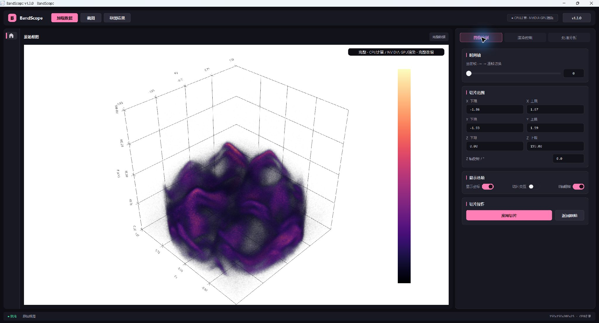
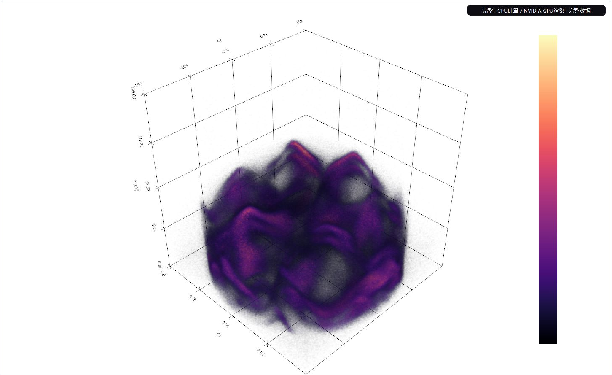
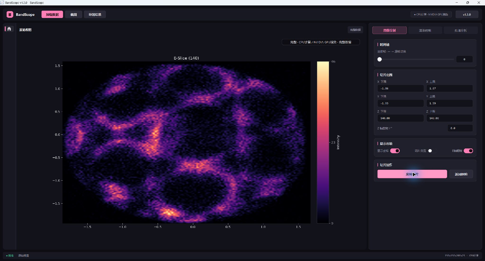
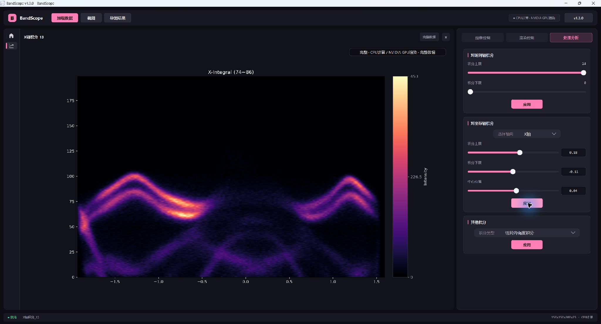
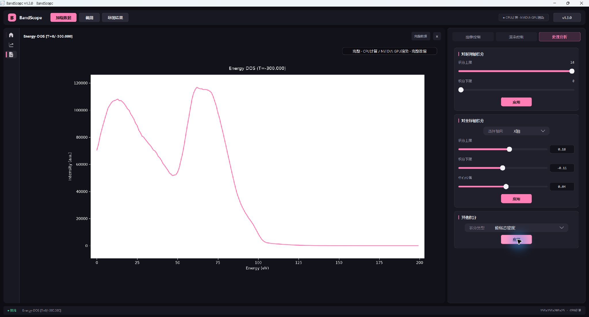

# BandScope

BandScope 是面向本地桌面实验环境的多维 ARPES 可视化与分析工作台，提供 `npz` / `mat` 数据加载、全局 ROI 数据域、3D 体渲染、2D 切片、交互裁剪、去噪、积分分析、DOS 分析、EDC 曲线、EDC 瀑布图、二阶导锐化、曲线比较、截图与结果导出，以及可独立安装的官方扩展等能力。当前源码版本为 **v1.12.4**。

> 本项目 GUI 基于 [ChinaIceF/PyQt-SiliconUI](https://github.com/ChinaIceF/PyQt-SiliconUI) 开源项目修改而来。

---

## 界面概览

### v1.12.4 更新

- **1D 截图与导出可以逐条编辑曲线**：单曲线、比较叠加、log 结果与瀑布图改用稳定曲线身份，可逐条或多选批量修改颜色、线型、线宽、透明度、点形状/大小/空心/间隔、显隐、名称、图例资格和绘制顺序。图例支持独立排序、列数、字号、边框/背景/间距、内外位置与自动避让，画布空间不足时明确报错；顺带修复科学计数公共指数被实际绘制清除的问题。
- **导出画布的轴、注记与瀑布图细化**：横纵轴可独立设置自动/手动范围、反向、主次刻度、刻线与网格，增加字号、色彩和四边留白；标题、轴名与字体统一放进右侧分页编辑区。文本、箭头、参考线和区间阴影可用数值输入编辑，新增统一撤销/重做。瀑布图增加统一色、分类色、灰度线型与按原始采样位置绑定的渐变，标签支持全部/关闭/每 N 条/自动稀疏。页面会话保留草稿，命名预设跨页面与重启复用。
- **截图字体可以按中英文分别选择**：「微调」面板新增英文（DejaVu Sans、Arial、Times New Roman、Georgia）与中文（微软雅黑、宋体、黑体、楷体）两个下拉框，覆盖标题、轴名、刻度、图例、面板编号与瀑布图标注；未安装的字体在下拉框中标注、渲染时回退。字体随样式保存，恢复默认样式时一并恢复。
- **2D 截图的刻线可以改方向与颜色**：「微调」面板新增刻线方向（朝内 / 朝外）与颜色（黑色 / 白色），只作用于刻线，刻度数字、轴名、边框与色条保持原色。
- **修复坐标轴积分端点与 E 轴翻转**：E 翻转后积分区间按显示坐标映射采样下标，切换翻转保留选中的采样范围与亚采样端点并重排序物理上下限，页面恢复与新页参数沿用保存时的显示方向；未锁定时端点越过另一端会推动它（反向拖动可以重新分开），锁定时整体平移并限制在轴边界内。三维选区与切片裁剪链仍保存原始物理坐标。见[轴积分端点与 E 翻转修复归档](docs/archive/axis-interval-fix/README.md)。
- 1D 样式经过自动化回归与实测窗口验收（WSe₂ 数据，单曲线 / 比较 / log / 瀑布，89 与 183 mm PNG/PDF），样例与记录见[1D 截图与导出样式归档](docs/archive/1d-export-style/README.md)；验收范围不含冻结包安装端到端检查与 PDF 逐页人工视觉检查。
- 平带增强扩展仍为 **1.2.1**，内容不变，本次发布沿用上一版目录中的插件包。

### v1.12.3 更新

- **界面观感收尾（只动样式，不动交互）**：设置弹窗（去噪参数、瀑布图步长）此前是系统浅色窗体上摆深色卡片，分组标题的白字糊成一片，现在窗体与主界面同底色。插件管理窗口的选中行不再用系统默认蓝，改为主色柔光底，状态列的「出错 / 待处理」改用主题语义色，页签与主界面页签呼应。消息框只给默认按钮上主色、其余按钮回到灰底，「确定」与「取消」恢复主次。页面树、结果页标题与设置菜单的右键菜单统一为深色圆角样式，禁用项灰化、分隔线可辨。
- **原生滚动条统一为深色细条**：插件管理表格、导出预览滚动区、页面树等原生 Qt 容器内容一多就会冒出 Windows 亮色滚动条和箭头按钮，全局样式补齐后与 SiUI 自绘滚动条观感一致。
- **打包改为可复现**：`.bsplugin` 的 zip 条目改用固定时间戳，摘要只由文件内容决定。此前打包会把源文件的 mtime 写进包，而 CI 的 checkout 把 mtime 设成运行时刻，于是同一份源码每次发布会打出不同摘要——官方目录按「同一 id/version 内容必须一致」校验，会把它判成内容被替换。平带增强扩展因此重新发一次为 **1.2.1**（功能与 1.2.0 完全相同，只是重打包）。
- 本版没有功能与行为改动；审计、修复与视觉验收记录见 [界面美化收尾归档](docs/archive/ui/ui-beautification-2026-10-07.md)。

### v1.12.2 更新

- **本版是 1.12 系列第一个真正发布的版本**：v1.12.0 的发布在测试任务就失败（`requirements.txt` 漏了插件签名用的 `cryptography`，CI 导入 `bandscope.extensions.trust` 报 `ModuleNotFoundError`）；v1.12.1 又在扩展任务的签名步骤失败（PowerShell 不替原生程序展开 `release/*.bsplugin`，签名脚本收到字面量后报“找不到文件”）。两次都没有产出 Release；1.12.2 修好这两处并补上回归测试后重新发布，功能内容与 v1.12.0 相同。
- **插件管理集中到一个窗口**：顶部工具栏新增「插件管理」按钮（替换原来的计算信息控件），安装、启用 / 停用、卸载、重试加载与恢复上一版本都在这里完成。安装、启停与卸载重启后生效；当前会话已加载的效果保持不变，窗口同时显示「当前状态」与「待生效操作」。
- **插件登记与安装事务重做（schema v2）**：期望配置与运行实例分开保存，安装内容按内容摘要不可变落盘，同版本不同内容直接拒绝；登记表损坏时保留原文件并进入只读诊断，不用空表覆盖。从 v1.11.x 升级会自动迁移并留下 `registry.json.v1.bak` 备份；**降级回旧版主程序前必须先按该备份恢复登记表与内容目录**，不能让旧版实例直接读写 v2 登记表。
- **兼容声明支持版本范围**：`requires_app` 可写成 PEP 440 范围（如 `>=1.9.0,<2.0.0`），安装、启动加载、构建脚本、官方目录筛选与升级评估共用同一套判定函数，同一份声明到哪儿都是同一个结论和同一句原因；裸版本号仍按精确匹配，旧清单不被自动放宽。
- **官方扩展来源验证**：官方插件包与官方目录都用 Ed25519 签名，宿主只用内置公钥验签。有签名但验不过或密钥未知一律拒绝，不会降级成未签名包；未签名包需要你确认后才安装，并记为「本地未验证」。已验证官方插件不会被未签名包静默覆盖。
- **程序内官方插件目录**：「插件管理」窗口新增「官方插件」页，可刷新、查看说明并安装或更新；安装前展示来源、当前版本与目标版本由你确认。主程序更新提示会先列出插件影响清单（可继续使用 / 升级后暂停加载 / 存在匹配更新 / 无法确认），存在风险项时默认选择「稍后」。
- **新增分析插件 API（API 2）**：最小能力范围是「当前已完成的二维结果 → 后台纯数值计算 → 新增一维结果页」，附二维积分演示插件；API 1 插件无需任何改动，按能力在对应页面显示各自的面板。
- 平带增强扩展升到 **1.2.0**：兼容声明由「主程序 `1.11.2` 精确匹配」放宽为 `>=1.9.0,<2.0.0`；功能与上一版一致。

### v1.11.2 更新

- **修复扩展管理面板里卸载按钮一直是灰的**：面板只在打开时算过一次按钮状态，用户点击扩展那一行不会重新求值，于是「卸载」「启用 / 停用」始终不可点。现在选中行会立刻反映到按钮上。顺带收紧了一处判定：只有**确实被选中**的行才算选中项，清空选择后按钮回到禁用，不再把「当前行」当成已选中——卸载不可撤销，不该在什么都没选中时可用。
- 在 v1.11.1 上遇到这个问题的用户可以绕开：在面板里选中那一行后点到别的窗口再点回来（或最小化再恢复），按钮会恢复正常。

### v1.11.1 更新

- **文档补齐**：把「插件管理入口与系统完善」的分阶段计划随源码一起发布。v1.11.0 的发布快照里只有代码，这份计划是之后保存的，因此补一个补丁版本把它纳入发布内容。没有功能改动。
- 主程序版本、安装器版本与平带增强扩展的 `requires_app` 同步升到 1.11.1；扩展包与主程序必须同号，升级主程序时请一并更新扩展。

### v1.11.0 更新

- **积分区间只有一份真值**：原来「积分上限 / 积分下限 / 中心位置」三个控件各自维护状态，拖动一侧会用旧值回写另一侧，计算又反过来从输入框反算下标，同一份区间在控件、页面参数和计算之间可以互不一致。现在收敛成一个物理区间模型（端点、长度、中心、锁定），控件只提交操作意图，模型负责约束后统一同步全部控件、输入框、锁定按钮与状态灯。
- **积分卡片换成「上下限 + 可输入长度 + 锁定」**：删除中心位置控件，新增可直接输入的**积分长度**与**锁定区间**按钮。锁定后改任一端都是整体平移，长度保持不变；未锁定时端点各自独立，不能越过另一端，允许零长度（对应单层采样）。
- **位置控制移到画布底栏**：当前轴向的 `kx / ky / E` 位置滑条与输入框放在时间轴左侧，控制积分区间中心。数据没有时间轴坐标时它直接占用原时间轴的位置，左侧不留空位；两条轴同排时分享可用宽度，窗口不够宽时「显示坐标 / E轴翻转 / Z轴旋转」整组下移到第二行，底栏高度同步增加。呼出与收起是 220 ms 的宽度 + 透明度过渡，快速切页或反向收起从当前进度继续。
- **左下角状态栏新增区间锁定指示**：「● 区间已锁定 / ● 区间未锁定」跟在运行状态灯旁边，分别用绿色和灰色。
- **保留精确物理区间**：端点可以落在采样点之间，计算时才映射到最近采样点，按原始下标排序后包含两端求和，等距时取较小下标。数值输入框按坐标分辨率设置精度与步长，不再固定两位小数——细步长坐标（如 `0.001`）之前会被显示舍入掉真实值。单位沿用数据元信息（缺单位不猜，索引回退坐标标注 `index`）。
- 单层切片页的位置输入保留物理值，实际切片取最近采样点，区间端点、长度与锁定操作禁用；移动位置时会更新产生该切面的源范围，同时保留面内裁剪与裁空链，旧的裁剪参数不会把位置覆盖回去。

### v1.10.0 更新

- **左侧换成常驻页面树**：原来 56 像素的图标栏和树浮层替换为一棵常驻的页面树，按来源关系显示层级，操作方式与 Windows 文件导航一致。点击名称切换页面，点击展开箭头只展开或收起；名称过长时可以横向滚动看全，并保留完整名称提示和页面类型图标。
- **页面树可以直接改名和删除**：右键或 `F2` 在树内直接编辑，`Enter` 或失焦保存、`Esc` 取消；空名称保持原名，重名自动追加编号。右键「删除页面」、树内 `Delete`、页眉关闭按钮与 `Ctrl + W` 走同一套规则：**每次都先确认**，确认框写明目标名称与总数、默认按钮是「取消」；父页连同全部派生页一起删除，主页与不可关闭的页面受保护。
- **树可以调宽并记住**：树与画布之间可拖动分隔条，初始 240 像素、最小 180 像素，画布至少保留 320 像素；栏宽跨重启保存。
- **树的操作**：顶部搜索框按名称过滤（不区分大小写），显示命中页面及其祖先，清空后恢复原来的展开状态和滚动位置；上下键移动选择、左右键展开收起、`Enter` 切页；同级拖拽排序（父页携带整支移动，禁止跨父页），搜索期间禁用排序。新建或外部切到被搜索隐藏的页面时会自动清空搜索并定位。
- 修复**删除非当前祖先后当前后代未切页**的问题；删除现在先算出完整集合，再按子页到父页清理，逐页发出关闭通知，最后统一刷新并激活存活页面。数字键切页改按页面树中可见行的顺序。

### v1.9.0 更新

- **轴标题可以直接编辑和拖动**：切片、积分、裁剪与二阶导图默认显示横纵轴标题，双击改名、按住拖动位置（拖出画布会被收回可见区），右键菜单提供「恢复默认文字」与 2D「恢复默认位置」。3D 主画布右键「轴标题…」编辑 X / Y / E 三条轴名，位置仍随相机自动排布。清空文字即隐藏该轴标题。导出快照沿用主画布的轴名，截图样式里显式填写的轴标签仍然优先。
- **页面可以改名**：双击工作区顶部的页面名称改名，右键菜单提供「重命名…」与「恢复自动名称」，重复名称自动追加编号。改名后页眉、侧栏提示、状态栏与页面树同步，页面身份、计算参数与来源关系不变；自动命名（积分区间、瀑布图步长等）继续更新底层默认名，但不会覆盖用户命名，换数据后回到自动名。
- 新增**扩展（插件）机制**：基础安装包只带通用扩展接口、扩展管理入口与渲染支持；官方扩展以独立的 `.bsplugin` 包发布在同一个 Release 里，导入后重启生效。扩展只改变显示效果，不改动原始强度、颜色映射、色条或数据导出的数值。
- 首个官方扩展 **平带增强**：自行添加任意条数的平带、分别设定能量中心与厚度，单独提高弱带的增强量，并淡化远离目标能量的背景，让弱带在 3D 体渲染里看得见。效果按页面独立保存，可在「渲染控制」卡片里与原图随时切换，3D 截图与图片导出沿用同一效果。
- 宿主为此新增**空间透明度通道**：体渲染的不透明度由「强度 + 能量」共同决定，同一强度在不同能量处可以有不同的透明度；原始强度数组保持逐位不变。
- 扩展管理放在画布右键菜单的「扩展管理…」：导入、启用 / 停用、卸载，安装根目录为 `%LOCALAPPDATA%\BandScope\extensions`，与主程序安装目录分开。
- 裁剪 / 裁空的**范围窗口改为点按钮直接打开**：不必再先右键呼出，窗口出现在按钮下方，按住标题行即可拖到任意位置，位置在同一次运行内沿用。窗口跟随开关——关闭工具栏按钮时窗口一并收起，开关打开期间切页或重新渲染后窗口自动回来；右键画布仍可把窗口移到光标处。
- **移除 `Shift` / `Ctrl` 单击切换左侧页面的快捷键**：它与视图里的 `Ctrl + 左键拖动` 冲突（按住 `Ctrl` 拖动后松开就被判成翻页）。翻页仍可用左侧导航栏的页面按钮、数字键 `1`–`4` 与 `Ctrl + W` 关页，`Shift + ←` / `Shift + →` 的十帧步进不受影响。

### v1.7.0 更新

- 图片导出的 **轴标签可以自己写**：「微调」面板新增「轴标签」行，2D / 1D 视图可改横轴与纵轴，3D 视图可改 X / Y / E 三条轴名。打开面板时带入当前自动轴名，只有改动过的才写入覆盖，**清空则该轴不显示标签**，「自动」按钮一键恢复全部。自动轴名仍按坐标来源与单位如实生成（缺单位不猜、索引回退用中性标签），用户命名只是其上的显式覆盖；3D 轴名只在主视图「坐标轴」开关打开时绘制，开关关闭时面板会提示。
- 新增 **透明背景导出**：导出 PNG 带 alpha 通道、PDF 页面底色留空，便于直接叠到深色幻灯片或后期排版；预览以棋盘格标示透明区域，导出的文件本身不含棋盘格。透明背景与尺寸 / DPI / 格式同属输出偏好，改动即持久化。

### v1.6.0 更新

- 「渲染控制」页顶部新增 **相机视角** 模块：只在左侧实际显示 3D 场景时平滑展开、切到 2D / 1D / 比较页时平滑收起；**方位角 / 仰角 / 滚转角 / 距离** 四个数值框与真实相机双向同步，鼠标旋转 / 滚转 / 缩放 / 平移后读数跟随，平移过的观察中心不会被拉回数据中心；唯一的 **重置视角** 按钮恢复默认等轴视图并对准当前内容重新取景，且与 **E轴翻转** 状态保持一致。
- 新增 **裁空** 模式：与 **裁剪** 共用框选与右键范围浮层，但清空选区内的数据而不是裁剪到选区；两种模式互斥，结果页标题与浮层文案随模式变化。
- 修正右侧控件面板的滚动：内容高于视口时滚动条与鼠标滚轮之前都不生效（内容变高后滚动条状态不会重算），现在整页可用滚轮上下滚动，底部卡片不再够不着。

### v1.5.2 更新

- 图片导出的标题可以自己写：「标题」行可直接输入图题，「自动」按钮恢复为结果自带标题，清空则不显示标题；标题行从仅 1D / 2D 可用扩展为四个视图族通用。
- 标题可排在**顶部或底部**、左 / 居中 / 右对齐，并用「距离」微调它与坐标框（含刻度、轴名、图例或顶/底色条）之间的间距，默认 1.5 mm。长标题按画布宽度换行，排版时避让实测注释，不再与坐标框或色条重叠。
- 自动检查更新由每 24 小时改为**每 12 小时**一次；后台检查失败时弹窗说明原因，并建议开启 VPN 或网络代理后手动检查，弹窗中的「三天内不再提示」只静音后续失败提示，检查仍照常进行。
- 新版本提示框新增「**一周内不再提示**」，按下后一周内的自动检查不再弹窗（检查本身继续执行），手动点击版本按钮始终正常提示。

### v1.5.0 更新

- 裁剪交互重构：顶部工具栏新增可保持选中态的 **裁剪** 按钮，3D 视图显示交互包围盒、2D / 1D / 瀑布图左键框选；右键「裁剪范围」浮层可直接输入各轴上下限，与框选双向同步。
- 每次裁剪生成新的结果页并保留来源页，可连续裁剪；截图与数据导出使用裁剪后的结果，瀑布图按显示坐标裁剪并保留曲线偏移，1D 曲线按数据点保留、缺口断开不插值。
- 删除「图像控制」页：时间轴与 **显示坐标 / E轴翻转 / Z轴旋转** 迁到画布下方的底条，视图控件右对齐常驻，滑条随窗口宽度伸缩、与控件只留一处与行内一致的间隙。
- 右侧控件面板由三个标签页精简为「渲染控制」「处理分析」两个，快捷键相应改为 `Ctrl + 1` / `Ctrl + 2`；各结果页仍分别保存自己的帧号、翻转与旋转状态。

### v1.4.0 更新

- 新增科研级图片导出：按左侧当前视图（3D / 2D / 1D）提供共九种样式，卡片预览与最终大图由同一快照、同一渲染器生成，导出前可微调画布背景、字体、边框、图例与色条排版。
- 图片导出支持 PNG；2D 与 1D 同时支持 PDF（热图为栅格，文字与曲线保留矢量）。导出在独立画布中完成，主视图的相机、色阶锁定、数据与页面状态在导出前后保持一致。
- 新增左侧时间轴条，显示当前帧与总帧数并支持拖动定位，随图像控制页的帧控件同步显隐。
- 处理分析：时间积分支持从坐标轴积分结果页（含裁剪页）派生同轴向、同积分区间的 2D 结果页。
- 布局与状态同步优化：统一卡片间距与滚动行为，修正程序化恢复状态时滑条与开关的视觉同步。

### v1.3.0 更新

- 统一深色界面、字体、数值输入框与按钮样式，按卡片组织控制项。
- 将加载数据、截图和结果导出集中到顶部工具栏，移除处理分析页的重复保存入口。
- 优化分栏宽度、页签与卡片间距，支持拖动分隔条及小窗口滚动操作。
- 切片范围采用两列输入布局，突出“应用切片”和“返回原始”；补充静态数据与时间锁定状态说明。
- 增加结果页标题、数据范围标记、底部状态栏和快捷键；普通操作反馈使用自动消失的轻提示。
- 修正程序化恢复状态时滑条、开关的视觉同步，并限制长色带菜单的展开高度。

应用窗口由工具栏、左右工作区和状态栏组成：

- **顶部 — 全局工具栏**：加载数据、截图样式、导出结果、裁剪、裁空、锁定色带、计算 / 渲染后端状态及版本更新入口。
- **左侧 — 结果工作区**：包含常驻页面树（顶部搜索框 + 按来源层级排列、可展开收起的页面）和主显示区域（3D 体渲染 / 2D 图像 / 1D 曲线 / 瀑布图 / 去噪参数面板）。每个分析结果以独立页面管理并保存自己的显示与分析控件状态；去噪参数跨页面共享，页面则保留创建时继承的数据范围。
- **左侧底部 — 画布底条**：左侧是时间轴（滑条 + 帧号 + 总帧数，仅含时间轴的数据展开），右侧右对齐排列 **显示坐标** / **E轴翻转** 开关与 **Z 轴旋转** 输入框；没有时间轴的数据只收起时间轴部分，视图控件常驻可用。
- **右侧 — 控件面板**：两个标签页，依次为「渲染控制」「处理分析」；内容高于视口时可用鼠标滚轮或右侧滚动条上下滚动（滑条仍保留滚轮微调）。
- **底部 — 状态栏**：运行状态、当前结果页、2D 光标坐标、数据形状与计算后端。

### 控件面板结构

| 标签页 | 主要功能 |
|---|---|
| 渲染控制 | 相机视角（仅在 3D 场景出现）、色带选择、黑场 / 灰场 / 白场色阶调整、强度映射方式（线性 / 对数 / 幂函数 / sigmoid）、三级去噪管线、计算后端选择 |
| 处理分析 | 时间积分、坐标轴积分（带物理坐标输入与中心锁定）、切片内强度积分、能级态密度、EDC 瀑布图、单条 EDC 曲线、二阶导 |

---

## 界面预览

**v1.4.0 主窗口**



本节图片均由本机 BandScope **v1.4.0** 实际运行界面截取（v1.5.0 起视图控件位于画布下方底条、右侧面板为两个标签页），使用 `WSe2_step.npz` 样例，数据形状为 `(150, 150, 200, 25)`（Kx、Ky、E、时间），包含 25 帧。样例的初始能量方向相反，加载后先开启 **E 轴翻转**，再生成切片与分析结果。以下截图均使用第 0 帧。

该文件未提供 E 坐标数组，因此截图中的能量数值使用默认索引 `0–199`；图中自动生成的 `eV` 标签不代表样例已完成能量标定。

设计稿及历史复查记录见 [历史归档](docs/archive/README.md)。开发入口见 [文档索引](docs/README.md)。

**3D 体渲染视图**



**E 切片视图**

开启顶部「裁剪」，在裁剪浮层中将 E 下限与上限均设为 `140`，点击「裁剪」得到等能面。



**坐标轴积分结果页**

沿 X 轴对索引 `74–86` 积分，对应界面显示的动量范围约为 `-0.11–0.18`。



**能级态密度结果页**

从完整数据的 3D 原始视图生成，展示第 0 帧（界面时间值 `-300.000`）的能级态密度。



---

## 安装与运行

### Windows 安装包（推荐）

正式发布后可从 [GitHub Releases](https://github.com/vergil-996/ARPES_3dMAP/releases) 下载与电脑环境对应的安装包：

- `BandScope-<版本>-Windows-x64-CPU-Setup.exe`：通用 CPU 版
- `BandScope-<版本>-Windows-x64-NVIDIA-Setup.exe`：包含 NVIDIA CUDA 数值后端的版本

安装器默认安装到当前用户的 `%LocalAppData%\Programs\BandScope`，不要求管理员权限。CPU 与 NVIDIA 安装包使用相同的应用标识，可以直接互相覆盖升级，用户设置仍保存在独立的 `QSettings` 中。

以前使用压缩包的用户需要手动运行一次 BandScope 安装器；自动更新能力从这次安装完成后开始生效。

安装版启动约 5 秒后会在后台检查 GitHub 最新正式 Release，每 12 小时最多自动检查一次；也可以点击顶部工具栏右侧的版本按钮手动检查。自动检查失败时会弹窗提示原因，并建议在开启 VPN 或网络代理后手动检查，弹窗中的「三天内不再提示」只会静音后续失败提示，后台检查仍照常进行。发现新版后，BandScope 会：

1. 选择与当前 CPU / NVIDIA 构建一致的安装包
2. 下载到当前用户的更新缓存目录
3. 使用 GitHub Release API 返回的 SHA-256 摘要校验完整性
4. 经用户确认后启动安装器并退出，由安装器在原目录完成覆盖升级

新版本提示框中的「一周内不再提示」会让此后一周的自动检查不再弹窗（检查本身继续执行），手动点击版本按钮仍然正常提示；「跳过此版本」则只针对当前这一个版本生效。

从源码运行时只会提示新版并打开 Release 页面，不会尝试覆盖源码目录。尚未配置代码签名证书时，更新确认框会明确警告；正式对外分发前建议签名安装包，并在 `bandscope/app_metadata.py` 中填写发布证书的 SHA-256 指纹。

### 从源码运行

Windows PowerShell:

```powershell
py -3.12 -m venv .venv
.\.venv\Scripts\activate
pip install -r requirements.txt
python start.py
```

如果 PowerShell 提示 `Activate.ps1` 被禁用，可以直接使用虚拟环境里的 Python 运行：

```powershell
.\.venv\Scripts\python.exe -m pip install -r requirements.txt
.\.venv\Scripts\python.exe start.py
```

macOS / Linux:

```bash
python3.12 -m venv .venv
source .venv/bin/activate
python -m pip install -r requirements.txt
python start.py
```

说明：

- 依赖列表见 [requirements.txt](requirements.txt)
- 启动入口为 [start.py](start.py)
- `requirements.txt` 中包含 `PyQt-SiliconUI` 的 GitHub 依赖，首次安装需要联网

---

## 支持的数据格式

### 推荐的 `npz` 字段

推荐输入字段如下：

```text
sample : 3D (Kx, Ky, E) 或 4D (Kx, Ky, E, T)
kx     : Kx 坐标，一维数组
ky     : Ky 坐标，一维数组
E      : 能量坐标，一维数组
time   : 时间 / delay 坐标，一维数组
```

说明：

- 程序会自动搜索 `npz` 中的主数据数组，优先识别 4D，再识别 3D
- 若坐标缺失，程序会按像素索引自动生成默认坐标
- 读入后内部会统一整理为 `(Kx, Ky, E, T)` 的分析格式
- 对于静态数据，程序会自动补一条长度为 1 的时间轴

### `.mat` 导入

导入 `.mat` 时，程序会先转换为 `.npz`。当前转换逻辑会优先识别以下常见字段别名：

- 主数据：`sample` / `binned` / `data`
- Kx 坐标：`kx` / `X`
- Ky 坐标：`ky` / `Y`
- 能量坐标：`E` / `energy`
- 时间坐标：`time` / `delay` / `t` / `T`

转换逻辑位于 [data_trans.py](bandscope/core/data_trans.py)，如需要添加字段可自行更改。

---

## 快捷键

| 快捷键 | 作用 |
|---|---|
| `Ctrl + O` | 加载数据 |
| `Ctrl + S` | 将当前视图保存为 PNG |
| `Ctrl + 1` / `Ctrl + 2` | 切换到渲染控制 / 处理分析 |
| `Ctrl + W` | 删除当前可删除的结果页（先弹确认） |
| `←` / `→` | 时间轴后退 / 前进一帧 |
| `Shift + ←` / `Shift + →` | 时间轴后退 / 前进十帧 |
| `1` / `2` / `3` / `4` | 数字键切换到对应位置的结果页或控件页（左侧按页面树中可见行顺序） |
| `F2` / `Delete` | 页面树持有焦点时：重命名选中页 / 删除选中页（先弹确认） |
| `↑` / `↓` | 页面树持有焦点时：移动选择 |
| `←` / `→` | 页面树持有焦点时：收起 / 展开当前分支 |
| `Enter` | 页面树持有焦点时：切换到选中页 |
| `Ctrl + C` | 当左侧显示 1D 曲线结果页时，复制当前曲线到剪贴板 |
| `Ctrl + V` | 将剪贴板中的曲线粘贴到当前 1D 曲线页，生成曲线比较图 |
| 鼠标滚轮 | 所有下拉框内的值可由鼠标滚轮快捷更改 |
| `Esc` | 裁剪 / 裁空模式下关闭「裁剪范围」窗口；窗口已关闭时退出裁剪模式 |
| 右键菜单 | 在 3D 视图或 2D 图上右键可弹出“去噪参数设置”“瀑布图步长设置”等快捷入口；裁剪 / 裁空模式下右键改为把「裁剪范围」窗口移到光标处 |

输入框、下拉框、页面树或其他滑条持有焦点时，方向键优先用于当前控件，不触发时间轴切帧。

---

## 控件功能说明

### 1. 画布底条

先从顶部工具栏加载数据，再在画布下方的底条上调整视图（原「图像控制」页已删除，控件全部收进底条）：

- 点击顶部 **加载数据** 导入 `npz` 或 `mat`
- 使用底条左侧时间轴的滑块或帧号输入框切换时间帧；静态数据禁用切帧并收起时间轴部分，只显示“静态数据 · 无时间维度”
- **Z 轴旋转角度**：在 Kx-Ky 平面内旋转 3D 数据体（-360° ~ 360°），位于底条最右
- 勾选 **显示坐标** 显示物理坐标轴
- **E轴翻转** 开关用于反转 E 轴显示方向：3D 视图保持 X/Y 数据轴不动并自动应用等价于上下拖动 180° 的相机视角；含能量轴的 2D/1D 结果同步反转
- 底条三个视图控件（显示坐标 / E轴翻转 / Z 轴旋转）右对齐常驻；滑条随窗口宽度伸缩、一直铺到视图控件前，与控件之间只留一处与行内一致的间隙，不会重叠
- 切换到其他结果页用左侧页面树（点击名称切换、点箭头收展，`Enter` 切页，`Ctrl+W` 删除当前页并先弹确认，数字键按树中可见行顺序跳页）；当前视图的截图与数据导出统一使用顶部工具栏

#### 裁剪模式

点击顶部工具栏的 **裁剪** 进入裁剪模式（按钮保持选中态，再次点击或在画布上按 `Esc` 退出）：

- 3D 体渲染中显示交互包围盒，拖拽手柄调整范围；2D / 1D / 瀑布图上直接用鼠标左键框选
- 点按钮即打开「裁剪范围」窗口：独立浮窗出现在按钮下方，点画布或别处不会把它关掉，可以一边框选一边改数值；按住标题行可拖到任意位置，窗口不会拖出屏幕
- 窗口内可直接输入各轴上下限数值，与框选双向同步；右键画布可把窗口移到光标处
- 点击窗口中的 **裁剪** 生成新的裁剪结果页，来源页保持不变；每个页面的框选草稿独立保留
- 按 `Esc` 关闭窗口、草稿不会丢失；关闭工具栏按钮时窗口一并关闭，开关打开期间切页或重新渲染后窗口自动回来
- 3D 中将任一轴的上下限设为同一位置时，裁剪生成该单层的 2D 结果页
- 3D 中三个轴都有厚度且旋转角为 `0°` 时，裁剪会提交一个覆盖全部 delay 帧的全局 ROI 数据域
- 坐标轴积分结果页上框选矩形并裁剪，生成裁剪后的结果页（`axis_integral_crop`），可用于限制 EDC 瀑布图的 k 值取值范围，或生成单条 EDC 曲线

#### 裁空

点击顶部 **裁空**，使用与裁剪相同的拖选方式（按钮同时打开同一扇可拖动的范围窗口），在窗口中输入范围后点击 **裁空**。操作生成新的结果页，选区内显示为空白，选区外的数据及原有坐标范围保留。支持 3D、2D、1D、比较曲线和瀑布图，可连续清空或继续裁剪；导出数据以 `NaN` 表示清空的采样点。再次点击按钮或在画布上按 `Esc` 退出。裁剪和清空模式互斥。

#### 全局 ROI 数据域

全局 ROI 用于将后续分析限制在感兴趣的三维空间范围内，适合费米面以下强带掩盖弱激发态等场景。

- 原始四维数据始终只读保留；每次新 ROI 都按照交互盒在原始 X/Y/E 索引中的绝对边界重新提取，不会相对上一个 ROI 继续裁剪
- ROI 只限制 X、Y、E，delay 轴保持完整
- 内部仅保存紧凑 ROI，不创建同尺寸的四维零背景副本
- 3D 使用带原始绝对索引 `extent` 的紧凑网格；2D/1D 在显示阶段嵌回完整坐标域，因此 ROI 外视觉强度为 0
- 时间积分、坐标轴积分、DOS、EDC、瀑布图和二阶导等后续计算只读取页面所属 ROI 与请求范围的交集
- 去噪和二阶导在紧凑 ROI 的局部边界内执行，避免把 ROI 外的虚拟零当成真实数据并在边缘制造伪峰
- 已存在的结果页固定使用创建时的数据范围；新页面继承直接来源页的数据范围。更换主页 ROI 不会修改旧页面
- 单层平面截取只生成临时 2D 视图，不会提交全局 ROI
- 非零旋转角下不能提交 ROI；ROI 页面需要旋转时，仅临时构造当前三维帧的零背景体，不创建全尺寸四维副本

### 2. 渲染控制页

在「渲染控制」页可以进一步调整显示效果：

- **相机视角**：只在左侧实际显示 3D 场景时平滑展开，切到 2D / 1D / 比较页 / 空结果时平滑收起。四个数值框与真实相机双向同步，唯一的 **重置视角** 按钮恢复默认等轴视图并对准当前内容重新取景

  | 参数 | 含义 |
  |---|---|
  | 方位角 | 绕世界 +Z 轴（数据体 E 轴）的水平方位角，0° = 相机在 +Kx 一侧，+90° = 转到 +Ky 一侧，范围 -180° ~ 180° |
  | 仰角 | 相机相对 Kx-Ky 平面的仰角，0° = 平视，+90° = 从 +E 方向俯视（极点），范围 -90° ~ 90° |
  | 滚转角 | 画面绕视线方向的旋转角，0° = 画面向上对齐 E 轴，范围 -180° ~ 180° |
  | 距离 | 相机到观察中心的距离（渲染坐标单位，场景为 200×200×200 的立方体） |

  数值可直接键入（回车或失焦提交，等价角度自动折进规范区间），也可用 ↑↓ 或滚轮微调；鼠标旋转 / 滚转 / 缩放 / 平移后输入框跟随真实相机，平移过的观察中心会被保留
- 切换色带（33 种 colormap，含 magma / inferno / viridis / coolwarm / jet 等）
- 调整 **黑场** / **灰场** / **白场**（0-100 滑块，灰场对应 Gamma 校正，50 为线性映射）
- 切换强度映射方式：**线性** / **对数** / **幂函数** / **sigmoid**
- 三级去噪管线（自上向下依次生效）：
  - **频域平滑** — 高斯滤波
  - **滑动平均** — 中值滤波
  - **Savitzky-Golay 滤波** — 多项式平滑（可调窗口长度、阶数、滑动轴）
  - **小波去噪** — 多级小波阈值去噪（可调小波基、分解层数、阈值规则、阈值模式、强度）
  - **卡尔曼滤波** — 沿时间轴的递归状态估计（仅 4D 数据有效）
  - **贝叶斯去噪** — 非局部均值去噪（NL-means）
- 去噪参数跨页面共享。应用后当前页面立即刷新，其他页面在再次激活时按照各自的数据范围延迟计算；曲线比较页保持创建时的快照
- 应用新的 S-G 参数前会统一验证所有仍被页面引用的数据域；窗口长度超过任一 ROI 对应轴长度时，整次应用会被拒绝并保留上一套结果

### 3. 处理分析页

在「处理分析」页可以生成新的结果页。每个生成的结果页独立管理，可关闭、可切换。生成结果后，使用顶部“截图”保存图像，或使用“导出结果”保存数据。

#### 3.1 时间积分

对 4D 数据的指定时间范围求和积分，并根据原始视图的当前形态生成结果页。

- 拖动积分上/下限滑块设置范围，点击 **应用**
- 原始视图为 3D 时，生成 3D 体渲染结果页
- 原始视图为 X / Y / E 单层 2D 切片时，生成同轴向的 2D 时间积分结果页；初始位置保持当前切片
- 原始视图为坐标轴积分结果页（含裁剪页）时，生成同轴向、同积分区间的 2D 时间积分结果页
- 2D 时间积分结果可由坐标轴积分区域的中心、上限和下限滑块实时控制切片位置与积分厚度
- 适用于含时间轴的动态数据

#### 3.2 坐标轴积分

对 X / Y / E 任一轴做区间积分，生成 2D 结果页。

- 下拉框选择轴向（X / Y / Z）
- 滑块设置积分下限、上限和中心位置
- 物理坐标输入框（`QDoubleSpinBox`）支持直接输入物理坐标值，与滑块双向联动
- 中心位置锁定机制：拖动上/下限时自动维持中心对称
- 点击 **应用** 生成结果页

坐标轴积分结果页上的交互：

- 开启顶部「裁剪」模式后，可用鼠标左键在 2D 图上框选矩形区域，右键打开「裁剪范围」浮层微调数值，点击「裁剪」生成裁剪后的结果页（`axis_integral_crop`）
- 每个页面的框选草稿独立保留，按 `Esc` 或点击浮层外可关闭浮层
- 裁剪结果页可用于限制 EDC 瀑布图的 k 值取值范围，或生成单条 EDC 曲线

#### 3.3 其他积分

在下拉框中选择分析类型后点击 **应用**：

| 类型 | 说明 |
|---|---|
| **切片内强度积分** | 将当前切片立方体内所有点的强度积分，横轴为时间，纵轴为总强度（仅 4D 数据有效） |
| **能级态密度** | 将等能面内所有点按强度积分，横轴为能量，纵轴为总强度。可从 3D 原始数据或坐标轴积分结果页生成 |
| **EDC 瀑布图** | 从 X/Y 轴积分结果页按步长选取一组动量值，画出错位堆叠的能量分布曲线 |
| **单条 EDC 曲线** | 从 Z 轴积分的裁剪结果页生成单条能量分布曲线 |
| **二阶导** | 2D 图沿能量轴计算强度负二阶导；3D 体视图可选择 X、Y 或 E 方向计算并生成新的 3D 体数据，用于锐化能带 |

---

## 结果工作区（左侧）

每个分析操作会生成一个新的结果页，显示在左侧页面树中（派生页挂在生成它的页面下，逐级展开）：

- **原始视图**（Home，不可关闭）— 初始数据显示页
- **时间积分** — 原始视图为 3D 时显示 3D 体渲染；原始视图为单层切片时显示可交互的 2D 结果
- **坐标轴积分 / 裁剪** — 2D 图像结果
- **切片内强度积分** — 1D 曲线（时间 vs 强度）
- **能级态密度** — 1D 曲线（能量 vs 强度）
- **EDC 瀑布图** — 堆叠曲线
- **单条 EDC 曲线** — 1D 曲线（能量 vs 强度）
- **二阶导** — 2D 图像或 3D 体渲染结果
- **曲线比较** — 1D 多曲线叠加对比

每个结果页独立管理：

- 切换页面时自动保存 / 恢复该页面的显示和分析控件状态
- 每个页面持久保存自己的数据域编号；新派生页继承直接来源页的数据域
- 去噪参数全局共享，但去噪结果按页面数据域缓存并在需要时计算
- 曲线比较页是快照，不随之后的去噪或数据域调整重新计算
- 可关闭的页面点击 X 按钮删除
- 加载新数据时自动清除所有结果页，重置为原始视图

2D 图像的比例只由数据决定，不跟随窗口宽高比：

- **kx–ky 面**（沿能量轴切片或积分的 2D 结果）两轴同为动量，按物理坐标 1:1 显示，动量空间的圆保持为圆；窗口变宽只在图像两侧留白，图像不会被拉扁
- **含能量轴的图像**（X / Y 切片与积分）横纵单位不同，等比没有物理意义，继续铺满画布
- 色条是图像的子坐标系，始终紧贴图像右缘并与其等高；1D 曲线与瀑布图不受影响，仍铺满画布

---

## 曲线比较功能

支持将同类型的 1D 曲线（能级态密度、切片内强度积分、单条 EDC 曲线）进行叠加比较：

1. 在 1D 曲线结果页下按 `Ctrl + C` 复制当前曲线
2. 切换到另一个同类型 1D 曲线结果页，按 `Ctrl + V` 粘贴
3. 自动生成「比较」结果页，基准曲线与叠加曲线以不同颜色和线型区分，并显示图例

也可在 2D 曲线图上右键选择「复制」/「粘贴」。

---

## 去噪参数设置

在 3D 视图或 2D 图上右键，选择 **去噪参数设置** 打开快捷窗口。三级去噪方法及其应用按钮位于右侧「渲染控制」页。

可调参数：

| 方法 | 参数 |
|---|---|
| Savitzky-Golay 滤波 | 滑动窗口长度（奇数，≥3）、多项式阶数（0-4）、窗口滑动轴（E / Kx / Ky） |
| 小波去噪 | 小波基（haar / db2 / db4 / sym4 / coif1）、分解层数（1-6）、阈值规则（universal / SURE / Bayes）、阈值模式（soft / hard）、强度（0-10） |

执行顺序固定为“提取页面数据域 → 在紧凑数据域内执行 S-G / 小波去噪 → 原子提交结果”。异步任务失败或被新任务取代时，界面继续显示上一套完整结果，不会出现半处理状态。

---

## 导出结果说明

### 截图

点击顶部工具栏的 **截图**，或按 `Ctrl + S`，将当前显示的图像或曲线保存为 PNG。

### 数据导出

点击顶部工具栏的 **导出结果**，可选择导出为 `.mat` 或 `.npz`；支持表格化的结果还提供 `.txt` / `.csv` 格式。数据尚未就绪或当前页不支持数据导出时，按钮禁用。曲线比较页可截图，暂不导出叠加曲线数据。

不同结果页导出不同结构的数据：

| 结果页类型 | 导出字段 |
|---|---|
| 完整数据主页 | `sample`、`kx`、`ky`、`E`、`time` |
| ROI 主页 | 紧凑 `sample`、ROI 对应的 `kx`、`ky`、`E`、完整 `time` |
| 时间积分 | `sample`、`kx`、`ky`、`E` |
| 坐标轴积分（X） | `sample`、`ky`、`E`、`time` |
| 坐标轴积分（Y） | `sample`、`kx`、`E`、`time` |
| 坐标轴积分（Z） | `sample`、`kx`、`ky`、`time` |
| 时间积分来源的 2D 坐标轴积分 | `sample`、剩余两条坐标轴、`integrated_axis`、`integrated_range`、`integrated_center`、`source_t_indices`、`source_t_range` |
| 坐标轴积分裁剪 | `sample`、`k`/坐标标签、`E`/坐标标签、`integrated_axis`、`integrated_range`、`crop_range` |
| 切片内强度积分 | `time`、`intensity` |
| 能级态密度 | `E`、`intensity`（含 `time` 或 `time_range` 元数据） |
| EDC 瀑布图 | `k`、`E`、`intensity`、`integrated_axis`、`integrated_range` |
| 单条 EDC 曲线 | `E`、`intensity`、`kx_range`、`ky_range`、`source_mode` |
| 二阶导（2D） | `sample`、`E`（含对应动量坐标标签） |
| 二阶导（3D） | `sample`、`kx`、`ky`、`E`、`derivative_axis`、`source_mode`，以及单帧的 `source_t_index`/`time` 或时间积分的 `source_t_indices`/`source_t_range` |

ROI 来源页面还会写入 `data_scope_id`、`data_scope_label`、`roi_index_bounds` 和 `roi_physical_bounds` 元数据。页面专属的 2D 矩形裁剪会继续在该页面的数据域基础上裁剪。

---

## 性能与缓存

- 原始四维数组作为只读数据源保留，不因 ROI 切换而复制或覆盖
- ROI、去噪结果和派生计算均使用包含数据域签名的缓存键
- 处理结果缓存采用按字节计量的 LRU，上限为一个原始四维数组的大小
- 3D 零旋转 ROI 使用紧凑计算与紧凑 VTK 网格；只有非零旋转需要临时构造一个全尺寸三维体
- 计算任务异步执行，并采用“最新请求优先”的原子提交方式，避免旧任务覆盖新的页面状态
- 2D 坐标气泡和矩形拖选使用局部 blit，鼠标移动时不会重复重绘整张 Matplotlib 图
- NVIDIA CUDA 可用时可选择 GPU 后端；不可用或运行失败时会自动回退到 CPU

---

## 扩展（插件）

基础安装包**不包含**任何扩展，只提供通用扩展接口、扩展管理入口与渲染支持。官方扩展以 `.bsplugin` 包的形式与主程序一起发布在同一个 Release 里，CPU 与 NVIDIA 安装版共用同一个扩展包。

插件分两类：**渲染效果类**（如平带增强）在 3D 视图里改变显示效果；**分析类**在已完成的二维结果上做后台数值计算，交回一维曲线，由主程序新建结果页——分析插件在后台线程运行，过程中界面仍可操作，结果挂在来源页下。

### 安装与卸载

1. 从本项目的 Release 下载与当前主程序版本匹配的扩展包。
2. 点顶部工具栏的「插件管理」，在窗口里点「安装插件…」选择下载的文件。
3. 按提示重启 BandScope，扩展即可用。

卸载、启用 / 停用同样在「插件管理」里操作，也是重启后生效：确认后**当前会话的效果保持不变**，重启时才切换；窗口里的状态列会写明待生效的操作（例如「运行中；待重启停用」）。插件加载失败时，窗口里提供「重试加载」与「恢复上一版本」。扩展安装在 `%LOCALAPPDATA%\BandScope\extensions`，与主程序安装目录分开存放，因此升级主程序不会影响已安装的扩展；主程序升级后不兼容的扩展会保留在磁盘上但停止加载，界面会说明需要安装兼容版本。

扩展不带自己的 NumPy / Qt / VTK / CUDA，全部复用主程序已有的运行环境，因此不额外占用磁盘，也不需要联网安装依赖。

### 来源与官方目录

「插件管理」窗口分两页：「已安装」管理本机插件，「官方插件」列出当前 Release 提供的签名目录。目录里显示每个插件对本机主程序的兼容结论（可安装 / 可更新 / 不兼容及原因），安装与更新都由你确认后才下载。

官方发布的包带 Ed25519 签名，窗口里显示「官方已验证」；本地自行导入的未签名包显示「本地未验证」，默认不安装，需要你明确确认。来源状态只说明包从哪里来，不改变插件行为。

> 当前仓库尚未配置发布签名密钥，因此本轮还没有可用的官方在线插件安装：发布工作流会在签名检查处失败，直到维护者按[构建与发布](docs/development/releasing.md)配置密钥与内置公钥。

### 平带增强（flat_band_opacity）

让指定的能带在 3D 体渲染里突出显示。在「渲染控制」页的「平带增强」卡片里：

- **添加平带**：条数由你决定，每条独立设置能量中心、厚度（高斯半高全宽）与增强量；
- **背景保留**：0%–100%，控制远离目标能量处的不透明度倍率；
- **总开关**：随时与原图比较，关闭时恢复原有渲染并完整保留参数；
- **重置显示参数**：恢复背景、增强量与厚度的建议值，保留已添加的数量与峰位；
- **导出 / 导入预设**：把整套条目参数存成 JSON；预设只记录单位信息，导入时不作隐含单位换算。

建议起始设置是背景保留 20%、每条增强量 0.8。对于分离良好的峰，中心倍率是 0.2 + 0.8 = 1，主要通过压低背景来突出能带；弱带再单独提高增强量即可。厚度初值按当前能量采样间距给出，只是可修改的建议，不是测得的线宽。

效果**只改变显示用的不透明度**：原始强度数组逐位不变，颜色映射、色阶（含色带锁定）、色条刻度、分析结果与所有数据导出的数值都不受影响。3D 截图与图片导出沿用同一效果。参数按页面独立保存，裁剪派生页拿到的是独立副本。

---

## 各分析功能的详细说明

### 1. 切片内强度积分

将用户设置的切片立方体内所有点按强度积分，横轴为时间，纵轴为总强度。

- 需要先有 ROI 范围：在 3D 视图用顶部「裁剪」按钮框定范围并裁剪，否则会提示「未进行切片设置」
- 不可用于没有时间轴的静态谱
- 可被画布底条上的「E轴翻转」开关调控
- 可被「渲染控制」里的去噪设置调控

### 2. 能级态密度

将等能面内所有点按强度积分，横轴为能量，纵轴为总强度。

- 可从 3D 原始视图生成（支持切片立方体限制范围），也可以从 X/Y 轴积分结果页生成
- 从坐标轴积分结果页生成时，自动使用该积分页的积分范围和裁剪区域
- 可被画布底条上的时间轴滑条调控
- 可被画布底条上的「E轴翻转」开关调控
- 可被「渲染控制」里的去噪设置调控

### 3. EDC 瀑布图

将坐标轴积分（仅限 Kx 或 Ky 轴积分）后的 2D 图像内按照步长选取一组动量值，画出这些动量值上的能量分布曲线（横轴为强度，纵轴为能量），曲线自动错位堆叠，并在底部标注对应动量值。

- 点击应用时，左侧视图页面必须为 X 轴 / Y 轴积分结果页，否则会弹出报错框
- k 步长可在左侧去噪参数面板或右键弹出窗口中设置；程序会根据坐标间距自动推荐默认步长
- 用户自定义步长后进入"自定义"模式，切换页面不会丢失
- 若源页面有矩形裁剪，瀑布图自动使用裁剪后的 k 范围
- 坐标轴积分的上下限会影响最终曲线形状
- 可被画布底条上的时间轴滑条调控
- 可被「渲染控制」里的去噪设置调控

___开启顶部“裁剪”模式后，可用鼠标左键在 2D 视图内框选矩形区域，右键打开浮层微调数值并点击“裁剪”生成裁剪结果页，用于限制 EDC 瀑布图 k 值的取值范围。___

### 4. 二阶导

用于生成强度的负二阶导锐化结果：

- 左侧为 X/Y 切片或 X/Y 轴积分结果时，固定沿能量轴计算，生成 2D 图像
- 左侧为主页或时间积分的 3D 体视图时，应用后弹窗选择 X、Y 或 E 求导方向；程序沿所选方向处理整个体数据并生成新的 3D 结果页
- 3D 计算在数值上等价于对包含所选方向的所有 2D 切片逐一求导后重新堆叠
- X/Y 切片生成的 2D 二阶导页由空间轴“中心位置”滑条切换切片，积分上下限控件会自动禁用
- X/Y 轴积分生成的 2D 二阶导页由积分下限、积分上限和中心位置三个滑条动态控制
- 2D 二阶导的滑条变化使用 35 ms 合并刷新，松开滑条时立即完成最终刷新

- 可被画布底条上的时间轴滑条调控
- 可被画布底条上的「E轴翻转」开关调控
- 可被「渲染控制」里的色带选择调控
- 可被「渲染控制」里的去噪设置调控

### 5. 单条 EDC 曲线

在坐标轴积分结果页（Z 轴）上框选矩形区域并截取后，生成单条能量分布曲线。

- 点击应用时，左侧视图页面必须为 Z 轴积分的裁剪结果页（`axis_integral_crop`），否则会弹出报错框
- 可被画布底条上的时间轴滑条调控
- 可被画布底条上的「E轴翻转」开关调控
- 可被「渲染控制」里的去噪设置调控

---

## 已知限制与说明

- 静态 3D 数据无法真实展示时间积分与切片内强度积分的动态能力
- README 中提到的样例路径仅用于说明截图来源，不要求用户按该绝对路径组织数据
- 目前的去噪设置中仅 Savitzky-Golay 滤波和小波去噪参数可调；频域平滑、滑动平均、卡尔曼滤波和贝叶斯去噪使用内置默认参数，可调参数可能会在后续更新中加入
- 曲线比较功能仅支持同类型的 1D 曲线（横轴必须匹配），不支持跨类型比较
- 泵浦前绝对差分 `ΔI` 与零中心发散色带尚未加入当前版本
- 扩展的效果只作用于 3D 体渲染；切到 2D / 1D / 比较页时卡片收起、效果不参与，切回 3D 时原样恢复
- 开启扩展效果后，即使倍率恒为 1，画面与关闭效果时也不是逐位相同：VTK 对二分量体数据的采样与单分量不完全等价（实测平均亮度差在 20% 以内，集中在强度梯度大的位置）。这是渲染通道本身的差异，关闭效果会逐位还原原图

---

## 参与贡献

开发前请阅读 [协作约定](AGENTS.md) 和 [目录地图](docs/architecture/repository-map.md)。

- 主程序：`bandscope/`；独立插件：`plugins/<id>/`。
- 自动化测试：`tests/`，统一运行 `python -m unittest discover -s tests -t . -v`。
- 开发、测试及发布说明：[文档索引](docs/README.md)。
- 实验数据、临时截图与日志放 `.local/`，不纳入 Git。

本项目所用 GUI，基于 GitHub 上 ChinaIceF 大佬的开源项目修改而来，参考大佬 GitHub 的源码地址：https://github.com/ChinaIceF/PyQt-SiliconUI

---

## 建议与反馈

- 若有其他改进建议或需添加功能或者 bug 反馈欢迎联系作者
- QQ：1277514490
- 邮箱：jiaxinyu25@mails.ucas.ac.cn
- 打赏：
