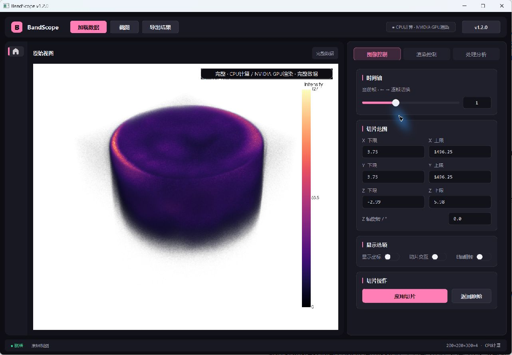

# 界面复查与本轮调整

保留原稿的深色背景与粉色强调色，优先改善科研操作中的可读性、空间利用和操作层级。修改直接叠加在现有实现上。

## 已处理

- 统一应用字体，SiUI 控件创建前设置 Segoe UI / 微软雅黑回退，数值使用等宽字体。
- 将背景样式限定到具体容器，消除标签、滑条块和品牌标题背后的杂色矩形。
- 整理顶栏，保留加载、截图、导出与版本入口；硬件状态改为低强调度显示。
- 收紧控制页外层边距、卡片间距和页签高度，限制启动时恢复的侧栏宽度，仍可拖动分隔条。
- 切片范围改成清楚的两列标签与输入框；旋转角度使用原生数值框，继续接入原有预览和刷新信号。
- 图像页操作区保留“应用切片”和“返回原始”，重复的加载、截图、导出入口集中到顶栏。
- 主操作使用粉底深色文字，禁用状态与次要操作有明确区别；顶栏导出按钮同步结果可导出状态。
- 对齐 SiUI 自绘输入框和下拉框的实际绘制色，色带菜单限制高度并允许滚动。
- 画布增加当前结果页标题和数据范围标记，结果页关闭按钮改为低强调度样式。
- 时间轴说明区分动态、静态和时间锁定状态；通知卡片预留正常句子的宽度，避开顶栏。

## 验证

- `python -m unittest discover -s tests`：157 项通过，包含旋转数值精度与预览信号的新增回归测试。
- 使用 `NiHITP_calibrated_2.npz` 静态数据与 `scan07_dynamic.npz` 四帧动态数据运行真实窗口。
- 检查三个控制页、动态切帧、下拉菜单与短窗口滚动；1280×860 窗口下参数区无横向溢出，底部操作可通过滚动访问。
- 实际 3D 渲染正常。`QWidget.grab()` 无法完整捕获这里的 OpenGL 画布，所以冒烟测试的窗口 PNG 中可能出现黑画布；下方实拍来自 Windows 窗口捕获。
- 修复冒烟测试替身缺少 `shutdown()` 导致退出时报错的问题，增加 `--hold` 和 `--size=宽x高` 便于复查；测试窗口不保存分栏尺寸。

## 后续设计建议

这一轮重点是主窗口与三个控制页。下一轮可以继续统一独立设置弹窗与结果导航浮层；给色带列表加入真实色带预览；在确认 X/Y/Z 与物理坐标的映射规则后，为输入框显示具体单位。3D 画布当前沿用已有白色背景，若增加深浅画布切换，需要同时适配坐标文字、标尺和图片导出。
