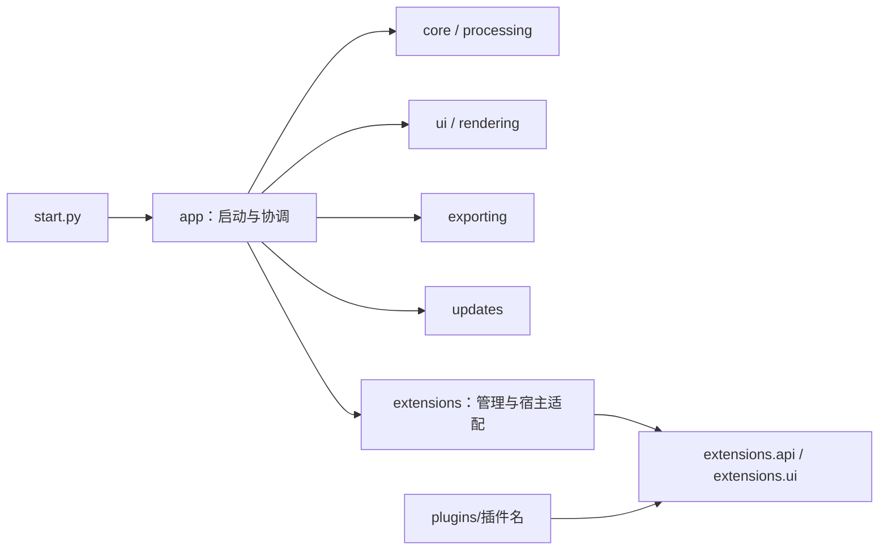

# 目录与模块地图

## 主程序

| 位置 | 职责与现有模块 |
|---|---|
| `bandscope/app/` | `startup` 启动；`refactored_app` 主窗口与总协调；`crop_integration` 裁剪接入；`qt_bootstrap` Qt 配置 |
| `bandscope/core/` | `analyzer_core` 数据加载；`axis_mapping` 坐标映射；`data_trans` 格式转换；`data_scope` 数据域；`crop_model` 裁剪模型 |
| `bandscope/processing/` | `compute_backends` 计算后端；`denoise_config` 参数；`denoise_engines` 去噪算法 |
| `bandscope/rendering/` | `render_core` 显示及体渲染；`refresh_pipeline` 刷新、任务和缓存失效协调 |
| `bandscope/ui/` | 控制页面、相机与裁剪控件、时间轴、结果工作区、主题、弹层与提示 |
| `bandscope/exporting/` | `publication_models` 数据契约；`publication_export` 快照；`publication_renderers` 出图；`publication_dialog` 导出交互 |
| `bandscope/extensions/` | `api` 插件协议；`ui` 公共界面组件；`plugin_manager` 安装加载；`plugin_host` 宿主接入；`plugin_dialog` 管理界面 |
| `bandscope/updates/` | `update_service` 网络及安装包校验；`update_controller` 更新交互 |
| `bandscope/app_metadata.py` | 应用名称、版本、构建类型与更新元信息 |

本轮保留原有实现和主要模块名。导出对话框与插件管理对话框跟随各自功能模块；其余通用控件放 `ui`。主窗口仍负责跨模块集成，进一步拆分另开任务。

这是职责图，现有实现仍存在渲染引用主题、计算后端引用刷新类型等跨目录依赖。迁移不强行改变这些关系。

## 新内容放置规则

| 内容 | 放置位置 |
|---|---|
| 可选功能插件 | `plugins/<id>/`，保持一个插件一个目录 |
| 模块自动化测试 | `tests/<对应模块>/` |
| 主窗口及跨模块测试 | `tests/integration/` |
| 插件业务测试 | `tests/plugins/<id>/` |
| 测试数据构造器、替身 | `tests/support/` |
| 发版、签名、插件构建脚本 | `scripts/release/` |
| 真实窗口与视觉验收脚本 | `scripts/validation/` |
| 临时问题的可复用诊断工具 | `scripts/diagnostics/` |
| PyInstaller / Windows 安装器 | `packaging/pyinstaller/` / `packaging/windows/` |
| 应用静态资源 | `assets/` |
| 正在实施的设计 | `docs/plans/` |
| 未完成工作的交接 | `docs/handoffs/` |
| 已结束的设计与历史记录 | `docs/archive/<主题>/`，附件一起归档 |
| 本机实验数据、输出、日志 | `.local/data/`、`.local/outputs/`、`.local/logs/` |
| 本机维护说明 | `.local/maintainer/`，不提交 |

根目录 `plugin_api.py`、`theme.py`、`ui_controls.py` 是兼容导入，和新路径指向同一个模块对象，不保留第二份实现。新代码不再使用这些旧路径。

## 并行工作的接入边界

功能任务可以独立修改其业务模块、测试和说明；主窗口、公开插件 API、依赖、打包配置与 CI 属于共享文件，由集成任务统筹。插件无需通过修改主窗口来注册具体业务功能；已有 API 不足时，先约定宿主能力，再分头实现。
